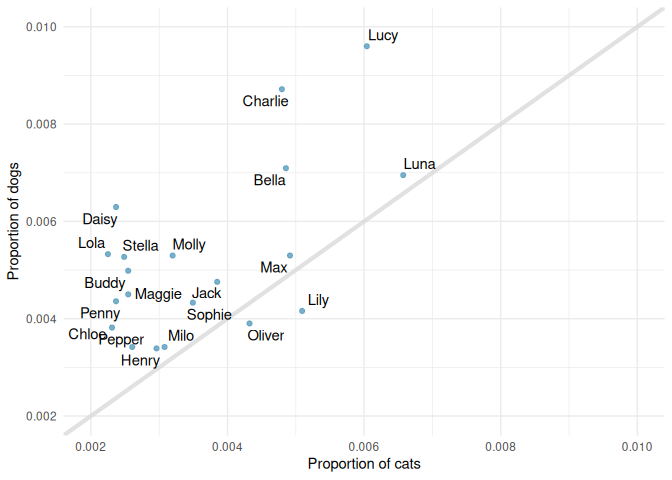

HW 01 - Pet names
================
hugo baba
february 3, 2026

## Load packages and data

``` r
library(tidyverse)
library(openintro)
library(ggrepel)
library(ggimage)
```

## Exercises

### Exercise 1

``` r
View(seattlepets)
nrow(seattlepets)
```

    ## [1] 52519

There are 52519 pets in the dataset.

### Exercise 2

There are 7 columns in the dataset.

### Exercise 3

``` r
seattlepets %>%
  filter(!is.na(animal_name)) |> 
  count(animal_name, sort = TRUE)
```

    ## # A tibble: 13,929 × 2
    ##    animal_name     n
    ##    <chr>       <int>
    ##  1 Lucy          439
    ##  2 Charlie       387
    ##  3 Luna          355
    ##  4 Bella         331
    ##  5 Max           270
    ##  6 Daisy         261
    ##  7 Molly         240
    ##  8 Jack          232
    ##  9 Lily          232
    ## 10 Stella        227
    ## # ℹ 13,919 more rows

The top three names are Lucy, Charlie and Luna.

### Exercise 4

``` r
seattlepets |> 
  group_by(species) |> 
  count(animal_name, sort = TRUE)
```

    ## # A tibble: 16,823 × 3
    ## # Groups:   species [4]
    ##    species animal_name     n
    ##    <chr>   <chr>       <int>
    ##  1 Cat     <NA>          406
    ##  2 Dog     Lucy          337
    ##  3 Dog     Charlie       306
    ##  4 Dog     Bella         249
    ##  5 Dog     Luna          244
    ##  6 Dog     Daisy         221
    ##  7 Dog     Cooper        189
    ##  8 Dog     Lola          187
    ##  9 Dog     Max           186
    ## 10 Dog     Molly         186
    ## # ℹ 16,813 more rows

``` r
seattlepets |>
  count(species, sort = TRUE)
```

    ## # A tibble: 4 × 2
    ##   species     n
    ##   <chr>   <int>
    ## 1 Dog     35181
    ## 2 Cat     17294
    ## 3 Goat       38
    ## 4 Pig         6

``` r
seattlepets |>
  group_by(species) |> 
  count(animal_name, sort = TRUE) |>
    slice_max(n, n = 20) 
```

    ## # A tibble: 84 × 3
    ## # Groups:   species [4]
    ##    species animal_name     n
    ##    <chr>   <chr>       <int>
    ##  1 Cat     <NA>          406
    ##  2 Cat     Luna          111
    ##  3 Cat     Lucy          102
    ##  4 Cat     Lily           86
    ##  5 Cat     Max            83
    ##  6 Cat     Bella          82
    ##  7 Cat     Charlie        81
    ##  8 Cat     Oliver         73
    ##  9 Cat     Jack           65
    ## 10 Cat     Sophie         59
    ## # ℹ 74 more rows

### Exercise 5

``` r
cats_n_dogs <- seattlepets |>
  filter(
    !is.na(animal_name),
    species %in% c("Cat", "Dog")) |>
  group_by(species) |> 
  count(animal_name, sort = TRUE)
```

``` r
name_props <- cats_n_dogs |>
  mutate(props = n / sum(n))

 dogs_props <- name_props |>
  filter(species == "Dog") |> 
  rename(dog_prop = props) |> 
  slice(1:30)

 cats_props <- name_props |>
  filter(species == "Cat") |> 
  rename(cat_prop = props) |> 
  slice(1:30)
 
 all_props <- inner_join(cats_props, dogs_props, 
                         by = "animal_name") |> 
   select(animal_name, cat_prop, dog_prop)
```

### Exercise 6

``` r
ggplot(all_props, aes(x = cat_prop, y = dog_prop)) +
  geom_abline(intercept = 0, color = COL["lgray", "full"],
              alpha = 0.8, linewidth = 1.5) +
  geom_text_repel(aes(label = animal_name),
                  segment.color = COL["lgray", "full"],
                  seed = 291252, max.iter = 9995) +
  geom_point(color = COL["blue", "full"], alpha = 0.8) +
  theme_minimal() +
  labs(x = "Proportion of cats", y = "Proportion of dogs") +
  xlim(0.002, 0.01) +
  ylim(0.002, 0.01) 
```

<!-- -->

``` r
# geom_emoji(
#       image = "1f436", aes(x = 0.003, y = 0.009), size = 0.1) +
#   geom_emoji(
#       image = "1f431", aes(x = 0.009, y = 0.003), size = 0.1)
```

1.  What names are more common for cats than dogs, those above the line
    or those below the line?

The names below the line are more common for cats than dogs. On the
inverse, the names above the line are more common for dogs than they are
for cats.

2.  Is the relationship between the two variables (proportion of cats
    with a given name and proportion of dogs with a given name) positive
    or negative? What does this mean in context of the data?

The shape of the slope is positive indicating a positive relationship
between the proportion of cats and dogs with a given name. That tells us
that the data has a positive correlation.
