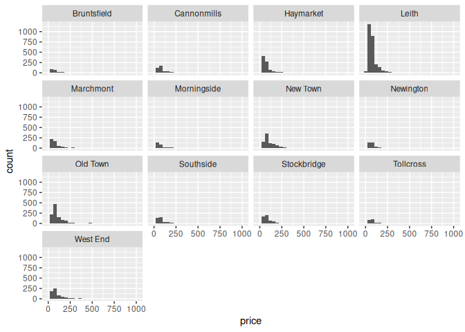
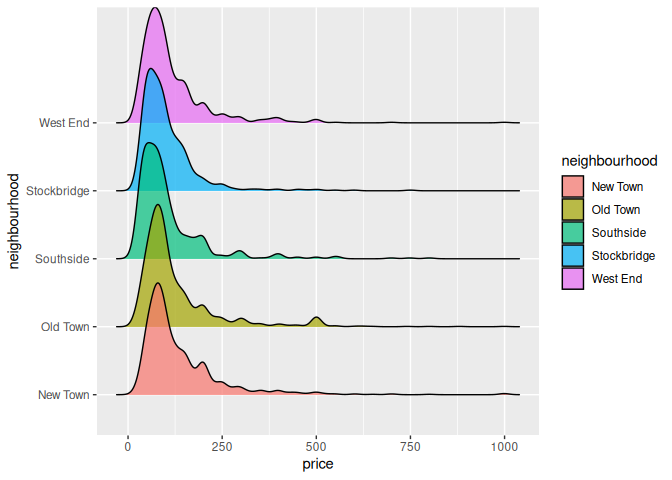
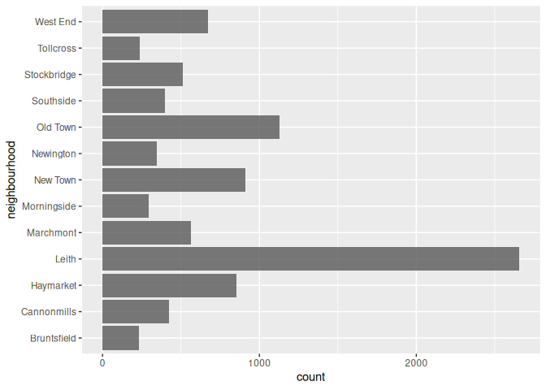

HW 01 - Airbnb listings in Edinburgh
================
Kairo
17/02/2026

## Load packages and data

``` r
library(tidyverse)
library(dsbox)
library(ggridges)
```

## Exercises

### Exercise 1

There are 13245 rows in the `edibnb` dataset.

### Exercise 2

Each row represents an observation of an apartment for rent on the
Airbnb in Edinburgh, with the id, price, bathrooms, bed, reviews and
other key features for someone considering to rent.

### Exercise 3

``` r
# drop NA values
edibnb_na <- edibnb |> 
  drop_na()

# Plot the rest in the histogram
ggplot(edibnb_na, aes(price)) +
  geom_histogram(binwidth = 40) +
  facet_wrap(~ neighbourhood, ncol = 4)
```

<!-- -->

### Exercise 4

``` r
edibnb |> 
  select(neighbourhood, price) |> 
  filter(!is.na(price)) |> 
  group_by(neighbourhood) |> 
  summarise(med = median(price)) |>
  arrange(desc(med)) |>
  slice(1:5)
```

    ## # A tibble: 5 × 2
    ##   neighbourhood   med
    ##   <chr>         <dbl>
    ## 1 New Town        100
    ## 2 Old Town         90
    ## 3 West End         90
    ## 4 Stockbridge      85
    ## 5 Bruntsfield      80

``` r
top_neighbourhood <- edibnb_na |> 
  select(neighbourhood, price) |> 
  # filter(!is.na(price)) |> 
  group_by(neighbourhood) |> 
  summarise(med = median(price)) |> 
  arrange(desc(med)) |>
  slice(1:5) |> 
  ungroup() |> 
  select(neighbourhood)
```

``` r
edibnb |> 
  filter(neighbourhood %in% top_neighbourhood$neighbourhood) |> 
  ggplot(aes(y = neighbourhood, x = price, fill = neighbourhood)) +
  geom_density_ridges(alpha = 0.7)
```

    ## Picking joint bandwidth of 13.4

    ## Warning: Removed 103 rows containing non-finite outside the scale range
    ## (`stat_density_ridges()`).

<!-- -->

``` r
edibnb |> 
  filter(neighbourhood %in% top_neighbourhood$neighbourhood) |>
  filter(!is.na(price)) |> 
  group_by(neighbourhood) |> 
  summarise(mini = min(price),
            maxi = max(price),
            means = mean(price),
            med = median(price),
            sdv = sd(price),
            iqr = IQR(price))
```

    ## # A tibble: 5 × 7
    ##   neighbourhood  mini  maxi means   med   sdv   iqr
    ##   <chr>         <dbl> <dbl> <dbl> <dbl> <dbl> <dbl>
    ## 1 New Town         12   999  136.   100 109.   86.5
    ## 2 Old Town         15   999  128.    90 110.   76  
    ## 3 Southside        10   800  107.    80  99.3  70  
    ## 4 Stockbridge      21   750  104.    85  77.6  66  
    ## 5 West End         19   999  116.    90  93.3  80

Explanation: The mean prices for each of the top five neighbourhoods is
higher than the median value, suggesting of course that they are
influenced by the maximum price in each neighbourhood. The New Town and
Old Town both have the highest distribution of high prices followed by
West End as observed from the means, even though the maximum are the
same.

### Exercise 5

``` r
edibnb |> 
  group_by(neighbourhood) |> 
  select(neighbourhood, review_scores_rating) |> 
  drop_na() |> 
  ggplot(aes(review_scores_rating, neighbourhood, fill = neighbourhood)) +
  geom_density_ridges(alpha = 0.8)
```

    ## Picking joint bandwidth of 1.23

<!-- -->

``` r
edibnb |> 
  group_by(neighbourhood) |> 
  select(neighbourhood, review_scores_rating) |> 
  drop_na() |> 
  ggplot(aes(y = neighbourhood)) +
  geom_bar(alpha = 0.8)
```

<!-- -->
