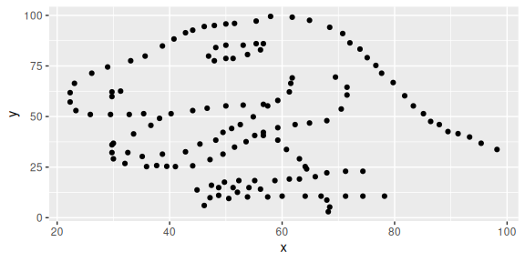
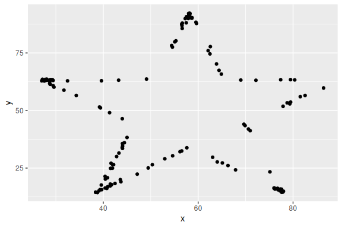
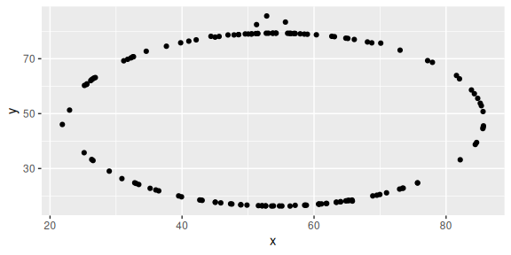

Lab 01 - Hello R
================
Kedman
2/12/2025

## Load packages and data

``` r
library(tidyverse) 
library(datasauRus)
```

## Exercises

### Exercise 1

``` r
datasaurus_dozen %>% 
  count(dataset) 
```

    ## # A tibble: 13 × 2
    ##    dataset        n
    ##    <chr>      <int>
    ##  1 away         142
    ##  2 bullseye     142
    ##  3 circle       142
    ##  4 dino         142
    ##  5 dots         142
    ##  6 h_lines      142
    ##  7 high_lines   142
    ##  8 slant_down   142
    ##  9 slant_up     142
    ## 10 star         142
    ## 11 v_lines      142
    ## 12 wide_lines   142
    ## 13 x_shape      142

### Exercise 2

First let’s plot the data in the dino dataset:

``` r
dino_data <- datasaurus_dozen %>%
  filter(dataset == "dino")

ggplot(data = dino_data, mapping = aes(x = x, y = y)) +
  geom_point()
```

<!-- -->

And next calculate the correlation between `x` and `y` in this dataset:

``` r
dino_data %>%
  summarize(r = cor(x, y))
```

    ## # A tibble: 1 × 1
    ##         r
    ##     <dbl>
    ## 1 -0.0645

### Exercise 3

``` r
star_data <- datasaurus_dozen %>%   
filter(dataset == "star") 

ggplot(data = star_data, mapping = aes(x = x, y = y)) +
  geom_point()
```

<!-- -->

``` r
star_data %>% 
  summarise(r = cor(x, y))
```

    ## # A tibble: 1 × 1
    ##         r
    ##     <dbl>
    ## 1 -0.0630

The correlation coefficient for star-data (-0.06296) and
dino-data-(-0.06447185) are similar as we see.

### Exercise 4

``` r
circle_data <- datasaurus_dozen %>%   
  filter(dataset == "circle")

ggplot(data = circle_data, mapping = aes(x = x, y = y)) +
  geom_point()
```

<!-- -->

``` r
circle_data %>% 
  summarize(r = cor(x, y))
```

    ## # A tibble: 1 × 1
    ##         r
    ##     <dbl>
    ## 1 -0.0683

The correlation coefficient for circle-data (-0.06834336) and
dino-data-(-0.06447185) are not so far apart.

### Exercise 5

Add code and narrative as needed. To add R chunks either type out the
backticks, curly braces, and the letter `r` or use the Insert chunk
button above, green C+.
