Lab 02 - Plastic waste
================
Keduba
03/12/2025

## Load packages and data

``` r
library(tidyverse) 
```

``` r
plastic_waste <- read_csv("data/plastic-waste.csv")
```

## Exercises

View the distribution of the plastic waste per capita, using a
histogram.

``` r
ggplot(data = plastic_waste, aes(x = plastic_waste_per_cap)) +
  geom_histogram(binwidth = 0.2)
```

    ## Warning: Removed 51 rows containing non-finite outside the scale range
    ## (`stat_bin()`).

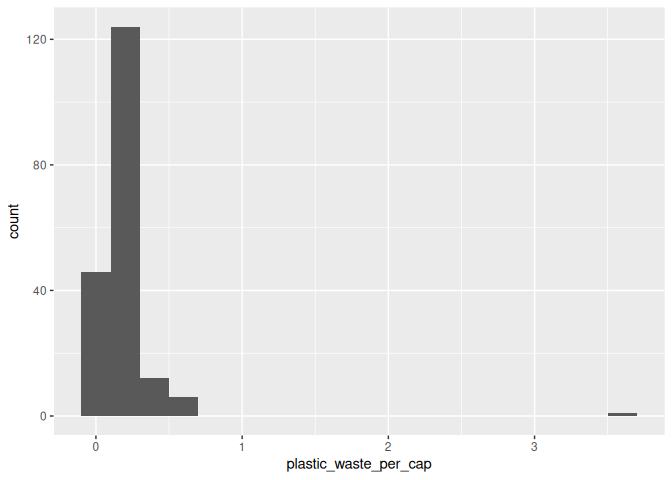<!-- -->

``` r
plastic_waste %>% 
  filter(plastic_waste_per_cap > 3)
```

    ## # A tibble: 1 × 10
    ##   code  entity              continent     year gdp_per_cap plastic_waste_per_cap
    ##   <chr> <chr>               <chr>        <dbl>       <dbl>                 <dbl>
    ## 1 TTO   Trinidad and Tobago North Ameri…  2010      31261.                   3.6
    ## # ℹ 4 more variables: mismanaged_plastic_waste_per_cap <dbl>,
    ## #   mismanaged_plastic_waste <dbl>, coastal_pop <dbl>, total_pop <dbl>

Quick question: Why would T&T have such a high rate of plastic waste per
capita?

### Exercise 1

``` r
ggplot(data = plastic_waste, aes(x = plastic_waste_per_cap)) +
  geom_histogram(binwidth = 0.2) +
  facet_wrap(~ continent)
```

    ## Warning: Removed 51 rows containing non-finite outside the scale range
    ## (`stat_bin()`).

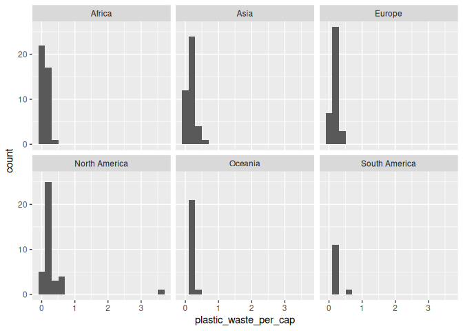<!-- -->

``` r
ggplot(data = plastic_waste, aes(x = plastic_waste_per_cap, 
                                 color = continent)) +
  geom_density()
```

    ## Warning: Removed 51 rows containing non-finite outside the scale range
    ## (`stat_density()`).

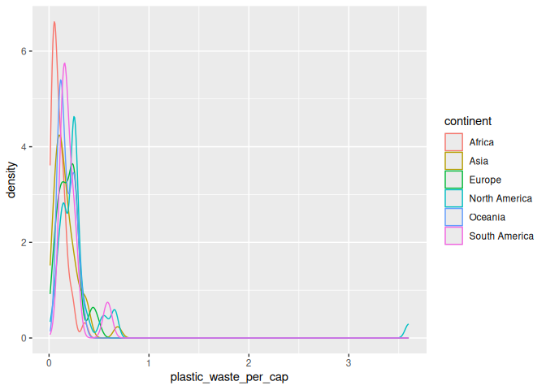<!-- -->

``` r
ggplot(data = plastic_waste, aes(x = plastic_waste_per_cap, 
                                 color = continent,
                                 fill = continent)) +
  geom_density()
```

    ## Warning: Removed 51 rows containing non-finite outside the scale range
    ## (`stat_density()`).

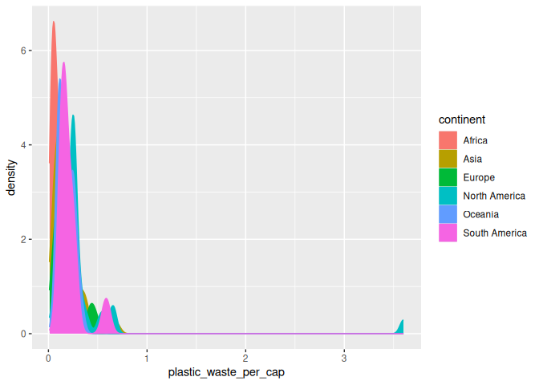<!-- --> \###
Exercise 2

``` r
ggplot(data = plastic_waste, aes(x = plastic_waste_per_cap, 
                                 color = continent,
                                 fill = continent
                                )) +
  geom_density(alpha = 0.4)
```

    ## Warning: Removed 51 rows containing non-finite outside the scale range
    ## (`stat_density()`).

<!-- -->

### Exercise 3

``` r
ggplot(data = plastic_waste, 
       mapping = aes(x = continent, 
                     y = plastic_waste_per_cap)) +
  geom_boxplot()
```

    ## Warning: Removed 51 rows containing non-finite outside the scale range
    ## (`stat_boxplot()`).

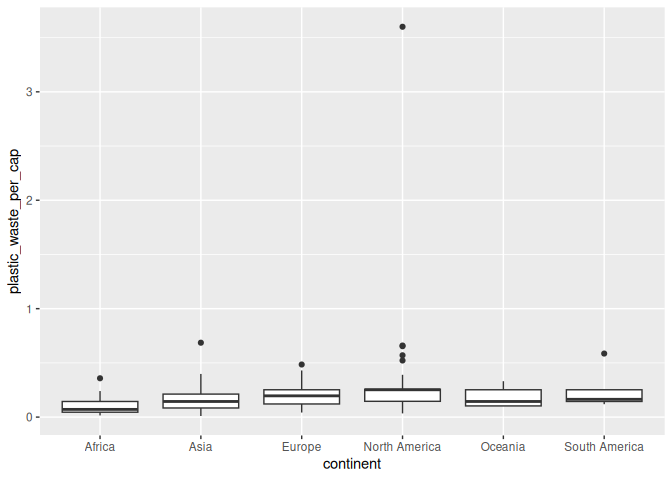<!-- --> \###
Exercise 4

With the violin plot, the spread of the data per continent is more
visible. This is not apparent with the box plots above. Although it’s
not very clear the data outside the iqr in the violin plots compared to
the box plots.

``` r
ggplot(data = plastic_waste, 
       mapping = aes(x = continent, 
                     y = plastic_waste_per_cap)) +
  geom_violin()
```

    ## Warning: Removed 51 rows containing non-finite outside the scale range
    ## (`stat_ydensity()`).

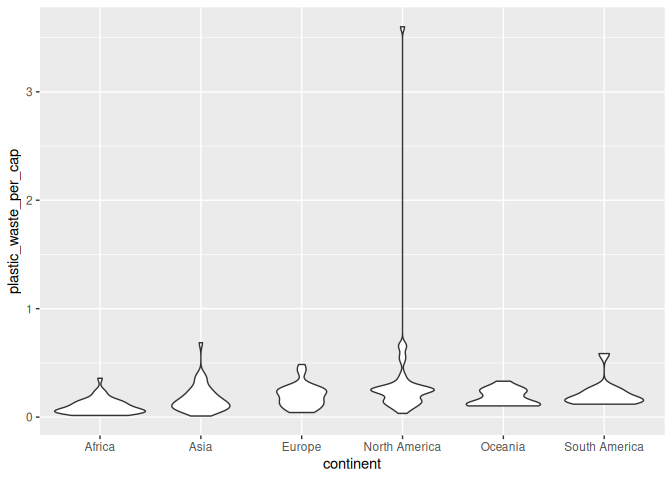<!-- -->

### Exercise 5

``` r
ggplot(plastic_waste, mapping = aes(x = plastic_waste_per_cap, 
                                    y = mismanaged_plastic_waste_per_cap)) +
  geom_point()
```

    ## Warning: Removed 51 rows containing missing values or values outside the scale range
    ## (`geom_point()`).

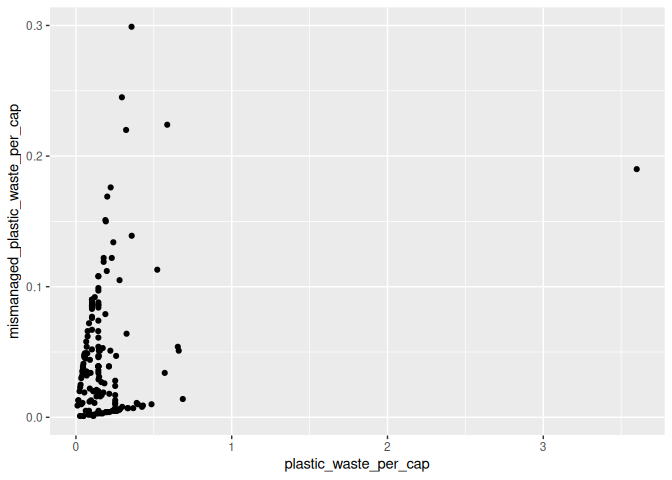<!-- -->
There seems to be a linear relationship between plastic waste per capita
and mismanaged plastic waste per capita with a few outliers. One of the
outliers could be T&T observed earlier in the histogram.

### Exercise 6

``` r
plastic_waste %>% 
  filter(plastic_waste_per_cap < 3) %>% 
ggplot(mapping = aes(x = mismanaged_plastic_waste_per_cap,
                                           y = plastic_waste_per_cap,
                                           colour = continent)) +
  geom_point()
```

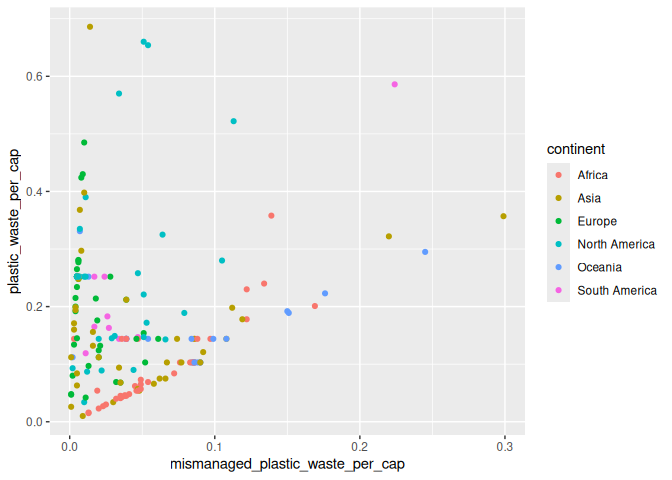<!-- -->
Europe has the smallest waste to mismanaged waste per capita ratio.
Africa and South America have similar associations. Oceania follows a
similar pattern as Africa.

### Exercise 7

``` r
plastic_waste %>% 
 filter(plastic_waste_per_cap < 3, total_pop < 5e+08) %>%
ggplot(aes(x = total_pop,
           y = plastic_waste_per_cap,
           colour = continent)) +
  geom_point()
```

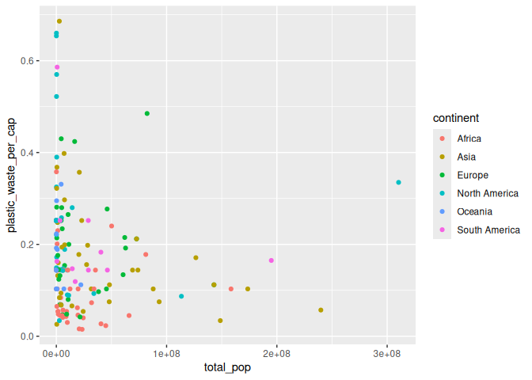<!-- -->

``` r
# plastic waste per cap vs coastal population
ggplot(plastic_waste, aes(x = coastal_pop,
                          y = plastic_waste_per_cap,
                          colour = continent)) +
  geom_point()
```

    ## Warning: Removed 51 rows containing missing values or values outside the scale range
    ## (`geom_point()`).

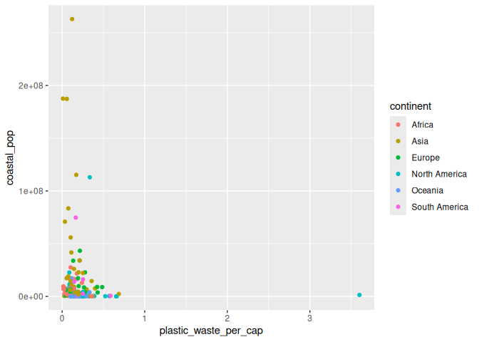<!-- -->
It appears that there is a stronger linear relationship between coastal
population and the plastic waste per capita than between the total
population and the same variable. Though we see that the population of
Asia contributes to this relationship more than in North America.

### Exercise 8

``` r
plastic_waste %>% 
  filter(plastic_waste_per_cap < 3) %>% 
  mutate(coastal_pop_prop = coastal_pop/total_pop) %>% 
  
ggplot(plastic_waste, mapping = aes(x = coastal_pop_prop,
                                    y = plastic_waste_per_cap,
                                    )) +
  geom_point(aes(colour = continent)) +
  geom_smooth(method = "loess") +
  labs(
    title = "Plastic waste vs coastal population proportion",
    subtitle = "by continent",
    x = "Coastal population proportion (coastal/total population",
    y = "Plastic waste per capita"
  )
```

    ## `geom_smooth()` using formula = 'y ~ x'

    ## Warning: Removed 10 rows containing non-finite outside the scale range
    ## (`stat_smooth()`).

    ## Warning: Removed 10 rows containing missing values or values outside the scale range
    ## (`geom_point()`).

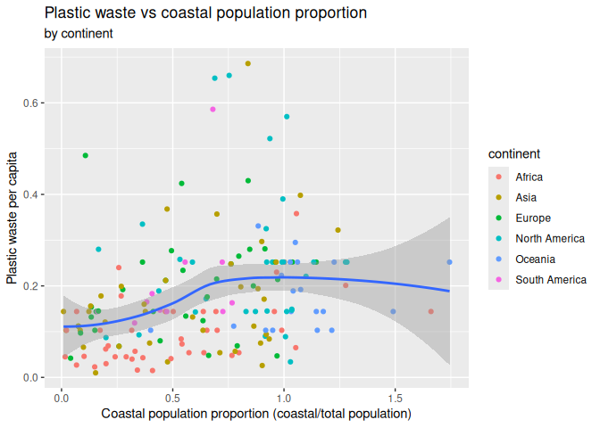<!-- --> Interpretation:
The loess smooth line follows an increase trend that isn’t exactly
linear. There seems to be a proportional increase with the plastic waste
per capita against the proportion of coastal residents to the total
population.
