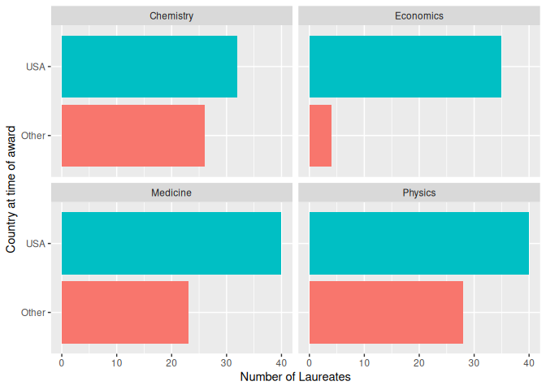
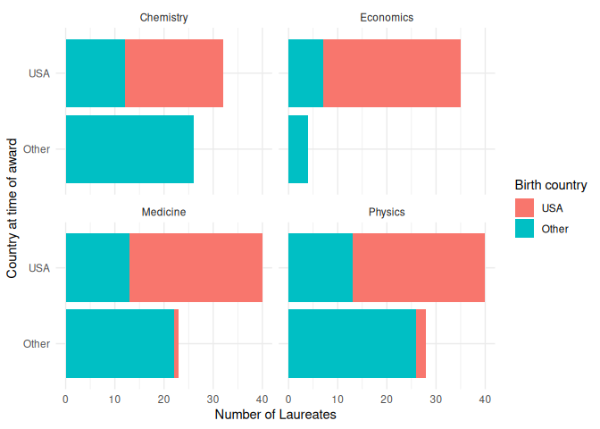

Lab 03 - Nobel laureates
================
Kedman
3/12/2025

### Load packages and data

``` r
library(tidyverse) 
```

``` r
nobel <- read_csv("../data/nobel.csv")
```

## Exercises

### Exercise 1

``` r
glimpse(nobel)
```

    ## Rows: 935
    ## Columns: 26
    ## $ id                    <dbl> 1, 2, 3, 4, 5, 6, 6, 8, 9, 10, 11, 12, 13, 14, 1…
    ## $ firstname             <chr> "Wilhelm Conrad", "Hendrik A.", "Pieter", "Henri…
    ## $ surname               <chr> "Röntgen", "Lorentz", "Zeeman", "Becquerel", "Cu…
    ## $ year                  <dbl> 1901, 1902, 1902, 1903, 1903, 1903, 1911, 1904, …
    ## $ category              <chr> "Physics", "Physics", "Physics", "Physics", "Phy…
    ## $ affiliation           <chr> "Munich University", "Leiden University", "Amste…
    ## $ city                  <chr> "Munich", "Leiden", "Amsterdam", "Paris", "Paris…
    ## $ country               <chr> "Germany", "Netherlands", "Netherlands", "France…
    ## $ born_date             <date> 1845-03-27, 1853-07-18, 1865-05-25, 1852-12-15,…
    ## $ died_date             <date> 1923-02-10, 1928-02-04, 1943-10-09, 1908-08-25,…
    ## $ gender                <chr> "male", "male", "male", "male", "male", "female"…
    ## $ born_city             <chr> "Remscheid", "Arnhem", "Zonnemaire", "Paris", "P…
    ## $ born_country          <chr> "Germany", "Netherlands", "Netherlands", "France…
    ## $ born_country_code     <chr> "DE", "NL", "NL", "FR", "FR", "PL", "PL", "GB", …
    ## $ died_city             <chr> "Munich", NA, "Amsterdam", NA, "Paris", "Sallanc…
    ## $ died_country          <chr> "Germany", "Netherlands", "Netherlands", "France…
    ## $ died_country_code     <chr> "DE", "NL", "NL", "FR", "FR", "FR", "FR", "GB", …
    ## $ overall_motivation    <chr> NA, NA, NA, NA, NA, NA, NA, NA, NA, NA, NA, NA, …
    ## $ share                 <dbl> 1, 2, 2, 2, 4, 4, 1, 1, 1, 1, 1, 1, 2, 2, 1, 1, …
    ## $ motivation            <chr> "\"in recognition of the extraordinary services …
    ## $ born_country_original <chr> "Prussia (now Germany)", "the Netherlands", "the…
    ## $ born_city_original    <chr> "Lennep (now Remscheid)", "Arnhem", "Zonnemaire"…
    ## $ died_country_original <chr> "Germany", "the Netherlands", "the Netherlands",…
    ## $ died_city_original    <chr> "Munich", NA, "Amsterdam", NA, "Paris", "Sallanc…
    ## $ city_original         <chr> "Munich", "Leiden", "Amsterdam", "Paris", "Paris…
    ## $ country_original      <chr> "Germany", "the Netherlands", "the Netherlands",…

``` r
c(nrow(nobel), ncol(nobel))
```

    ## [1] 935  26

### Exercise 2

All the living nobel laureates. Their country is known, the gender is
not “org” and they’re still alive.

``` r
nobel_living <- nobel %>% 
  filter(country != "NA", gender != "org", is.na(died_date)) 
```

What laureates were in US at the time of their award.

``` r
nobel_living$country %>% unique()
```

    ##  [1] "USA"            "United Kingdom" "Denmark"        "Switzerland"   
    ##  [5] "Germany"        "France"         "Netherlands"    "Canada"        
    ##  [9] "Sweden"         "Japan"          "Israel"         "Australia"     
    ## [13] "Belgium"        "Norway"         "China"

``` r
# method 1
nobel_living <- nobel_living %>% 
  mutate(country_us = fct_other(country, "USA"))

# method 2
nobel_living <- nobel_living %>% 
  mutate(
    country_us = if_else(country == "USA", "USA", "Other")
  )
```

Extract the science-based laureates

``` r
scifields <- c("Physics", "Chemistry", "Economics", "Medicine")
nobel_living_sci <- nobel_living %>% 
  filter(category %in% scifields)
```

### Exercise 3

- a bar plot to see the relationship between prize category and country
  at time of award.
- facet by category.
- horizontal bars

``` r
ggplot(data = nobel_living_sci, mapping = aes(y = country_us, 
                                              fill = country_us)) +
  geom_bar() +
  facet_wrap(~ category) +
  labs(
    x = "Number of Laureates",
    y = "Country at time of award",
  ) +
  guides(fill = "none")
```

<!-- -->

### Exercise 4

- Laureates born in the US vs other countries

``` r
nobel_living_sci <- nobel_living_sci %>% 
  mutate(born_country_us = fct_other(born_country, "USA"))
nobel_living_sci %>% 
  filter(born_country_us == "USA") %>% 
  count()
```

    ## # A tibble: 1 × 1
    ##       n
    ##   <int>
    ## 1   105

105 awardees were born in the US out of 228.

### Exercise 5

Those who won while in the USA and who were born in the USA.

``` r
ggplot(data = nobel_living_sci, mapping = aes(y = country_us, 
                                              fill = born_country_us)) +
  geom_bar() +
  facet_wrap(~ category) +
  labs(
    x = "Number of Laureates",
    y = "Country at time of award",
    #color = "Country of birth"
  ) +
  guides(fill = guide_legend(title = "Birth country")) +
  theme_minimal()
```

<!-- --> It does appear
that of the number of awardees in the USA, more were born in the USA
than were immigrants.

### Exercise 6

…
