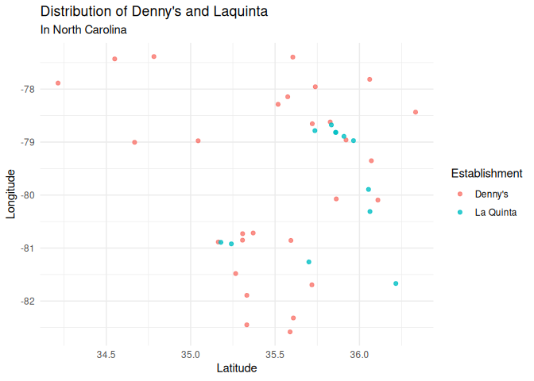
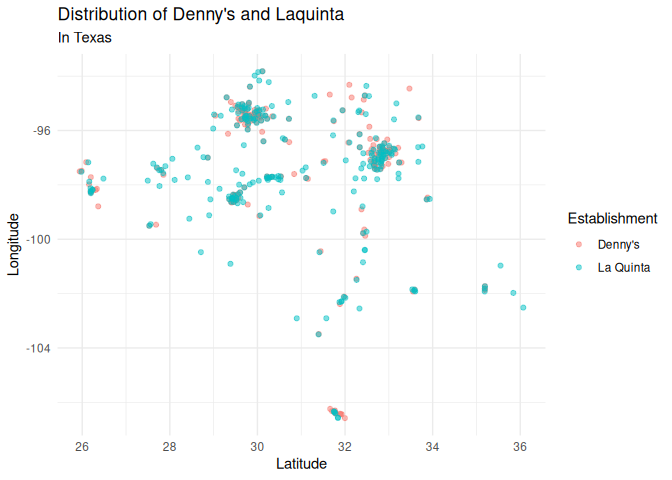

Lab 04 - La Quinta is Spanish for next to Denny’s, Pt. 1
================
Kedman
4/12/2025

### Load packages and data

``` r
library(tidyverse) 
library(dsbox)
```

``` r
states <- read_csv("data/states.csv")
```

### Exercise 1

``` r
glimpse(states)
```

    ## Rows: 51
    ## Columns: 3
    ## $ name         <chr> "Alabama", "Alaska", "Arizona", "Arkansas", "California",…
    ## $ abbreviation <chr> "AL", "AK", "AZ", "AR", "CA", "CO", "CT", "DE", "FL", "GA…
    ## $ area         <dbl> 52420.07, 665384.04, 113990.30, 53178.55, 163694.74, 1040…

``` r
c(nrow(states), ncol(states))
```

    ## [1] 51  3

``` r
dim(states)
```

    ## [1] 51  3

1.  The number of rows is 51 and the number of columns is 3.
2.  The dimension is \[51 x 3\]
3.  The names of the columns or variables are name, abbreviation, area.
4.  Each row represents a US state with its code and area in square
    miles.

### Exercise 2

1.  The dimensions of La Quinta is \[909 x 6\].
2.  Each row represents the address of a La Quinta including its
    geographical coordinates.
3.  The columns or variables are address, city, state, zip, longitude,
    latitude.

### Exercise 3

La Quinta is also found in Canada, Mexico, China, Colombia, Ecuador,
United Arab Emirates, Georgia, Turkiye and New Zealand.

``` r
glimpse(laquinta)
```

    ## Rows: 909
    ## Columns: 6
    ## $ address   <chr> "793 W. Bel Air Avenue", "3018 CatClaw Dr", "3501 West Lake …
    ## $ city      <chr> "\nAberdeen", "\nAbilene", "\nAbilene", "\nAcworth", "\nAda"…
    ## $ state     <chr> "MD", "TX", "TX", "GA", "OK", "TX", "AG", "TX", "NM", "NM", …
    ## $ zip       <chr> "21001", "79606", "79601", "30102", "74820", "75254", "20345…
    ## $ longitude <dbl> -76.18846, -99.77877, -99.72269, -84.65609, -96.63652, -96.8…
    ## $ latitude  <dbl> 39.52322, 32.41349, 32.49136, 34.08204, 34.78180, 32.95164, …

### Exercise 4

To use the data to find out if there are non-USA locations of La Quinta,
we can combine this data with the data on US states. By cross-reference
of the state code, we could identify locations that are not part of the
US states as non-US locations.

### Exercise 5

``` r
dennys %>% 
  filter(!(state %in% states$abbreviation))
```

    ## # A tibble: 0 × 6
    ## # ℹ 6 variables: address <chr>, city <chr>, state <chr>, zip <chr>,
    ## #   longitude <dbl>, latitude <dbl>

### Exercise 6

``` r
dennys <- dennys %>% 
  mutate(country = "United States")
```

### Exercise 7

La Quinta is also found in Canada, Mexico, China, Colombia, Ecuador,
United Arab Emirates, Georgia, Turkiye and New Zealand.

### Exercise 8

What countries are La Quinta’s offices?

``` r
laquinta <- laquinta %>% 
  mutate(country = case_when(
    state %in% state.abb ~ "United States",
    state %in% c("ON", "BC") ~ "Canada",
    state == "ANT" ~ "Colombia",
    state %in% c("VE", "PU", "AG", "CH", "QR", "NL", "SL") ~ "Mexico" 
    )
  )
```

To work with only La Quinta USA

``` r
laquinta <- laquinta %>% 
  filter(country == "United States")
```

### Exercise 9

``` r
state_freq <- dennys %>% 
  count(state, sort = TRUE)
```

The biggest state is CA, 403 and the least state is DE, 1.

``` r
laquinta %>% 
  count(state, sort = TRUE) %>% 
  head(5)
```

    ## # A tibble: 5 × 2
    ##   state     n
    ##   <chr> <int>
    ## 1 TX      237
    ## 2 FL       74
    ## 3 CA       56
    ## 4 GA       41
    ## 5 TN       30

``` r
head(state_freq)
```

    ## # A tibble: 6 × 2
    ##   state     n
    ##   <chr> <int>
    ## 1 CA      403
    ## 2 TX      200
    ## 3 FL      140
    ## 4 AZ       83
    ## 5 IL       56
    ## 6 NY       56

``` r
laquinta %>% 
  count(state, sort = TRUE) %>% 
  tail(10)
```

    ## # A tibble: 10 × 2
    ##    state     n
    ##    <chr> <int>
    ##  1 IA        4
    ##  2 MI        4
    ##  3 WV        3
    ##  4 WY        3
    ##  5 AK        2
    ##  6 NH        2
    ##  7 RI        2
    ##  8 SD        2
    ##  9 VT        2
    ## 10 ME        1

``` r
tail(state_freq, 10)
```

    ## # A tibble: 10 × 2
    ##    state     n
    ##    <chr> <int>
    ##  1 ND        4
    ##  2 WY        4
    ##  3 AK        3
    ##  4 IA        3
    ##  5 NH        3
    ##  6 SD        3
    ##  7 WV        3
    ##  8 DC        2
    ##  9 VT        2
    ## 10 DE        1

### Exercise 10

``` r
dennys %>% 
  count(state) %>% 
  inner_join(states, by = c("state" = "abbreviation")) %>% 
  mutate(density = n/area) %>% 
  arrange(desc(density))
```

    ## # A tibble: 51 × 5
    ##    state     n name                     area  density
    ##    <chr> <int> <chr>                   <dbl>    <dbl>
    ##  1 DC        2 District of Columbia     68.3 0.0293  
    ##  2 RI        5 Rhode Island           1545.  0.00324 
    ##  3 CA      403 California           163695.  0.00246 
    ##  4 CT       12 Connecticut            5543.  0.00216 
    ##  5 FL      140 Florida               65758.  0.00213 
    ##  6 MD       26 Maryland              12406.  0.00210 
    ##  7 NJ       10 New Jersey             8723.  0.00115 
    ##  8 NY       56 New York              54555.  0.00103 
    ##  9 IN       37 Indiana               36420.  0.00102 
    ## 10 OH       44 Ohio                  44826.  0.000982
    ## # ℹ 41 more rows

``` r
dennys <- dennys %>% 
  mutate(establishment = "Denny's")

laquinta <- laquinta %>% 
  mutate(establishment = "La Quinta")
```

``` r
dn_lq <- bind_rows(dennys, laquinta)
```

``` r
ggplot(dn_lq, mapping = aes(x = latitude, y = longitude, colour = establishment)) +
  geom_point()
```

<!-- -->

### Exercise 11

Visualise North Carolina

``` r
dn_lq %>% 
  filter(state == "NC") |> 
  ggplot(aes(x = latitude, y = longitude, colour = establishment)) +
  geom_point(alpha = 0.8) +
  labs(
    x = "Latitude",
    y = "Longitude",
    title = "Distribution of Denny's and Laquinta",
    subtitle = "In North Carolina",
    colour = "Establishment"
  ) + 
  theme_minimal()
```

<!-- -->

### Exercise 12

Visualise Texas

``` r
dn_lq %>% 
  filter(state == "TX") |> 
  ggplot(aes(x = latitude, y = longitude, colour = establishment)) +
  geom_point(alpha = 0.5) +
  labs(
    x = "Latitude",
    y = "Longitude",
    title = "Distribution of Denny's and Laquinta",
    subtitle = "In Texas",
    colour = "Establishment"
  ) + 
  theme_minimal()
```

<!-- -->
