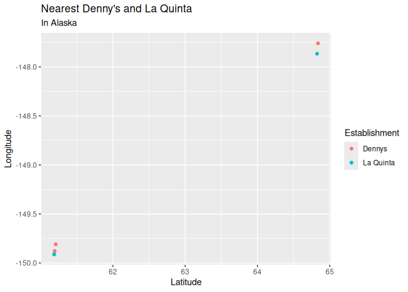
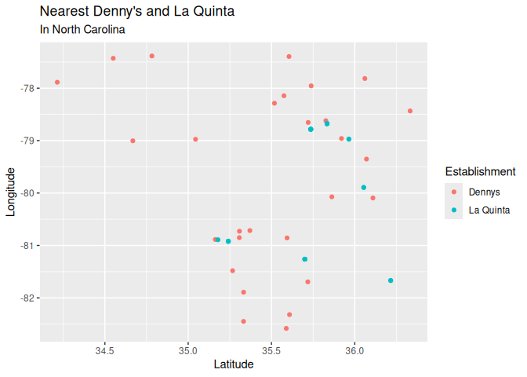
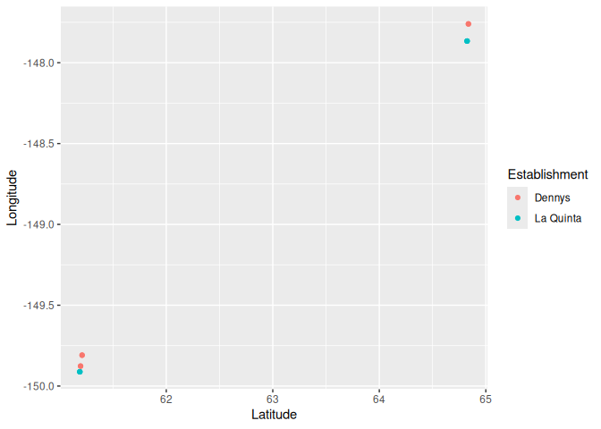

Lab 04 - La Quinta is Spanish for next to Denny’s, Pt. 2
================
Kedman
6/12/2025

### Load packages and data

``` r
library(tidyverse) 
library(dsbox) 
```

``` r
states <- read_csv("data/states.csv")
```

### Exercise 1

``` r
dn_ak <- dennys |> 
  filter(state == "AK")
nrow(dn_ak)
```

    ## [1] 3

### Exercise 2

``` r
lq_ak <- laquinta |> 
  filter(state == "AK")
nrow(lq_ak)
```

    ## [1] 2

### Exercise 3

``` r
dn_lq_ak <- full_join(dn_ak, lq_ak, by = "state")
```

    ## Warning in full_join(dn_ak, lq_ak, by = "state"): Detected an unexpected many-to-many relationship between `x` and `y`.
    ## ℹ Row 1 of `x` matches multiple rows in `y`.
    ## ℹ Row 1 of `y` matches multiple rows in `x`.
    ## ℹ If a many-to-many relationship is expected, set `relationship =
    ##   "many-to-many"` to silence this warning.

``` r
dn_lq_ak
```

    ## # A tibble: 6 × 11
    ##   address.x     city.x state zip.x longitude.x latitude.x address.y city.y zip.y
    ##   <chr>         <chr>  <chr> <chr>       <dbl>      <dbl> <chr>     <chr>  <chr>
    ## 1 2900 Denali   Ancho… AK    99503       -150.       61.2 3501 Min… "\nAn… 99503
    ## 2 2900 Denali   Ancho… AK    99503       -150.       61.2 4920 Dal… "\nFa… 99709
    ## 3 3850 Debarr … Ancho… AK    99508       -150.       61.2 3501 Min… "\nAn… 99503
    ## 4 3850 Debarr … Ancho… AK    99508       -150.       61.2 4920 Dal… "\nFa… 99709
    ## 5 1929 Airport… Fairb… AK    99701       -148.       64.8 3501 Min… "\nAn… 99503
    ## 6 1929 Airport… Fairb… AK    99701       -148.       64.8 4920 Dal… "\nFa… 99709
    ## # ℹ 2 more variables: longitude.y <dbl>, latitude.y <dbl>

### Exercise 4

There are 6 observations in the new data frame.

The names of the variables are: address.x, city.x, state, zip.x,
longitude.x, latitude.x, address.y, city.y, zip.y, longitude.y,
latitude.y.

### Exercise 5

``` r
haversine <- function(long1, lat1, long2, lat2, round = 3) {
  # convert to radians
  long1 = long1 * pi / 180
  lat1  = lat1  * pi / 180
  long2 = long2 * pi / 180
  lat2  = lat2  * pi / 180
  
  R = 6371 # Earth mean radius in km
  
  a = sin((lat2 - lat1)/2)^2 + cos(lat1) * cos(lat2) * sin((long2 - long1)/2)^2
  d = R * 2 * asin(sqrt(a))
  
  return( round(d,round) ) # distance in km
}
```

To add a variable to a data frame while keeping the existing variables,
we use the `mutate` function from the tidyverse.

### Exercise 6

``` r
dn_lq_ak <- dn_lq_ak |> 
  mutate(distance = haversine(longitude.x, latitude.x, longitude.y, latitude.y))
```

### Exercise 7

``` r
dn_lq_ak_mindist <- dn_lq_ak |> 
  group_by(address.x) |> 
  summarise(nearest = min(distance))
```

### Exercise 8

describe the distribution of the distances between Dennys and the
nearest La Quinta in Alaska.

``` r
dn_lq_ak |> 
  filter(distance %in% dn_lq_ak_mindist$nearest) |> 
  select(address.x, starts_with("long"), starts_with("lat")) |> 
  rename(
    longitude_x = longitude.x,
    longitude_y = longitude.y,
    latitude_x = latitude.x,
    latitude_y = latitude.y
  ) |> 
  pivot_longer(
    cols = !address.x,
    names_to = c(".value", "Establishment"),
    names_sep = "_"
  ) |> 
  mutate(Establishment = if_else(Establishment == "x", "Dennys", "La Quinta")) |> 
  ggplot(aes(x = latitude, y = longitude, colour = Establishment)) +
  geom_point() +
  labs(
    title = "Nearest Denny's and La Quinta",
    subtitle = "In Alaska",
    x = "Latitude",
    y = "Longitude"
  )
```

<!-- -->

### Exercise 9

``` r
dn_nc <- dennys |> 
  filter(state == "NC")

lq_nc <- laquinta |> 
  filter(state == "NC")

nrow(dn_nc)
```

    ## [1] 28

``` r
nrow(lq_nc)
```

    ## [1] 12

``` r
dn_lq_nc <- full_join(dn_nc, lq_nc, by = "state", relationship = "many-to-many")
```

``` r
dn_lq_nc <- dn_lq_nc |> 
  mutate(distance = haversine(longitude.x, latitude.x, longitude.y, latitude.y))
```

``` r
dn_lq_nc_mindist <- dn_lq_nc |> 
  group_by(address.x) |> 
  summarise(nearest = min(distance))

dn_lq_nc |> 
  filter(distance %in% dn_lq_nc_mindist$nearest) |> 
  select(address.x, starts_with("long"), starts_with("lat")) |> 
  rename(
    longitude_x = longitude.x,
    longitude_y = longitude.y,
    latitude_x = latitude.x,
    latitude_y = latitude.y
  ) |> 
  pivot_longer(
    cols = !address.x,
    names_to = c(".value", "Establishment"),
    names_sep = "_"
  ) |> 
  mutate(Establishment = if_else(Establishment == "x", "Dennys", "La Quinta")) |> 
  ggplot(aes(x = latitude, y = longitude, colour = Establishment)) +
  geom_point() +
  labs(
    title = "Nearest Denny's and La Quinta",
    subtitle = "In North Carolina",
    x = "Latitude",
    y = "Longitude"
  )
```

<!-- -->

``` r
dn_lq_ak |> 
  rename(
    longitude_x = longitude.x,
    longitude_y = longitude.y,
    latitude_x = latitude.x,
    latitude_y = latitude.y
  ) |> 
  select(address.x, starts_with("long"), starts_with("lati")) |> 
  pivot_longer(
    cols = c(starts_with("long"), starts_with("lat")),
    names_to = c(".value", "loca"),
    names_sep = "_"
  ) |> 
  mutate(loca = if_else(loca == "x", "Dennys", "La Quinta")) |> 
  ggplot(aes(x = latitude, y = longitude, colour = loca)) +
  geom_point() +
  labs(
    colour = "Establishment",
    x = "Latitude",
    y = "Longitude"
  )
```

<!-- -->
