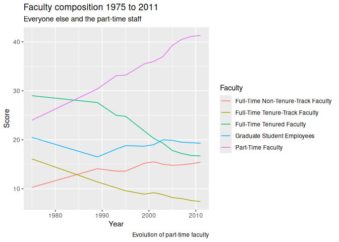
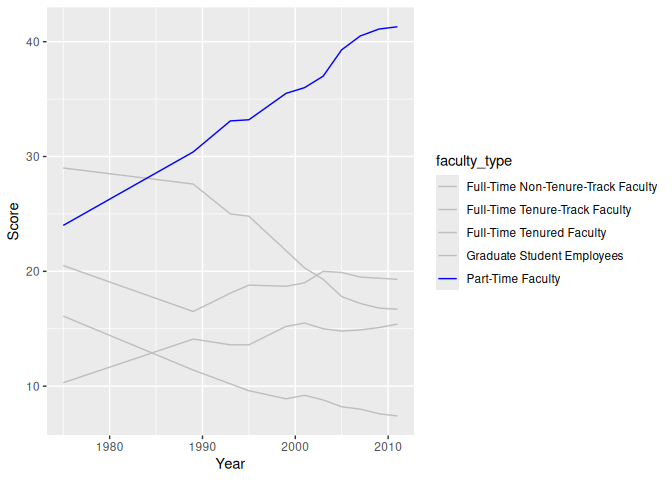
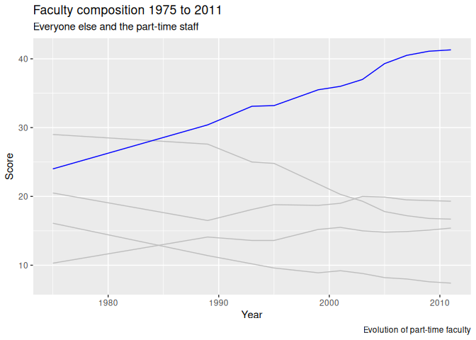
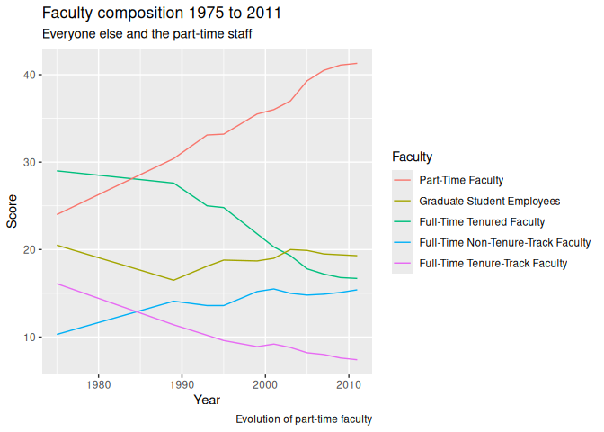

Lab 06 - Sad plots
================
KEdman
7/12/2025

### Load packages and data

``` r
library(tidyverse) 
library(dsbox) 
```

``` r
staff <- read_csv("data/instructional-staff.csv")
```

    ## Rows: 5 Columns: 12
    ## ── Column specification ────────────────────────────────────────────────────────
    ## Delimiter: ","
    ## chr  (1): faculty_type
    ## dbl (11): 1975, 1989, 1993, 1995, 1999, 2001, 2003, 2005, 2007, 2009, 2011
    ## 
    ## ℹ Use `spec()` to retrieve the full column specification for this data.
    ## ℹ Specify the column types or set `show_col_types = FALSE` to quiet this message.

``` r
spec(staff)
```

    ## cols(
    ##   faculty_type = col_character(),
    ##   `1975` = col_double(),
    ##   `1989` = col_double(),
    ##   `1993` = col_double(),
    ##   `1995` = col_double(),
    ##   `1999` = col_double(),
    ##   `2001` = col_double(),
    ##   `2003` = col_double(),
    ##   `2005` = col_double(),
    ##   `2007` = col_double(),
    ##   `2009` = col_double(),
    ##   `2011` = col_double()
    ## )

``` r
staff
```

    ## # A tibble: 5 × 12
    ##   faculty_type    `1975` `1989` `1993` `1995` `1999` `2001` `2003` `2005` `2007`
    ##   <chr>            <dbl>  <dbl>  <dbl>  <dbl>  <dbl>  <dbl>  <dbl>  <dbl>  <dbl>
    ## 1 Full-Time Tenu…   29     27.6   25     24.8   21.8   20.3   19.3   17.8   17.2
    ## 2 Full-Time Tenu…   16.1   11.4   10.2    9.6    8.9    9.2    8.8    8.2    8  
    ## 3 Full-Time Non-…   10.3   14.1   13.6   13.6   15.2   15.5   15     14.8   14.9
    ## 4 Part-Time Facu…   24     30.4   33.1   33.2   35.5   36     37     39.3   40.5
    ## 5 Graduate Stude…   20.5   16.5   18.1   18.8   18.7   19     20     19.9   19.5
    ## # ℹ 2 more variables: `2009` <dbl>, `2011` <dbl>

``` r
staff_long <- staff |> 
  pivot_longer(
    cols = !faculty_type,
    names_to = "year"
  ) |> 
  mutate(year = as.numeric(year))

staff_long
```

    ## # A tibble: 55 × 3
    ##    faculty_type               year value
    ##    <chr>                     <dbl> <dbl>
    ##  1 Full-Time Tenured Faculty  1975  29  
    ##  2 Full-Time Tenured Faculty  1989  27.6
    ##  3 Full-Time Tenured Faculty  1993  25  
    ##  4 Full-Time Tenured Faculty  1995  24.8
    ##  5 Full-Time Tenured Faculty  1999  21.8
    ##  6 Full-Time Tenured Faculty  2001  20.3
    ##  7 Full-Time Tenured Faculty  2003  19.3
    ##  8 Full-Time Tenured Faculty  2005  17.8
    ##  9 Full-Time Tenured Faculty  2007  17.2
    ## 10 Full-Time Tenured Faculty  2009  16.8
    ## # ℹ 45 more rows

### Exercise 1

``` r
staff_long |> 
  ggplot(aes(year, value, colour = faculty_type)) +
  geom_line() +
  labs(
    x = "Year",
    y = "Score",
    colour = "Faculty",
    title = "Faculty composition 1975 to 2011",
    subtitle = "Everyone else and the part-time staff",
    caption = "Evolution of part-time faculty"
  )
```

<!-- -->

### Exercise 2

To highlight the proportion of the part-time faculty, we can do several
things:

- let it show by reordering it in the legend to align with the line
  plot.
- give it a different colour from the others in the line plots

### Exercise 3

``` r
staff_long |> 
  ggplot(aes(year, value, group = faculty_type, colour = faculty_type)) +
  geom_line() +
  scale_color_manual(values = c(rep("gray", 4), "blue")) +
  labs(
    x = "Year",
    y = "Score"
  )
```

<!-- -->

``` r
staff_long |> 
  ggplot(aes(year, value, group = faculty_type,
             colour = fct_reorder2(faculty_type, year, value))) +
  geom_line() +
  scale_color_manual(values = c("blue", rep("gray", 4))) +
  labs(
    x = "Year",
    y = "Score",
    colour = "Faculty",
    title = "Faculty composition 1975 to 2011",
    subtitle = "Everyone else and the part-time staff",
    caption = "Evolution of part-time faculty"
  ) +
  guides(colour = "none")
```

<!-- -->

``` r
staff_long |> 
  ggplot(aes(year, value, group = faculty_type,
             colour = fct_reorder2(faculty_type, year, value))
         ) +
  geom_line() +
  labs(
    x = "Year",
    y = "Score",
    colour = "Faculty",
    title = "Faculty composition 1975 to 2011",
    subtitle = "Everyone else and the part-time staff",
    caption = "Evolution of part-time faculty"
  )
```

<!-- -->
