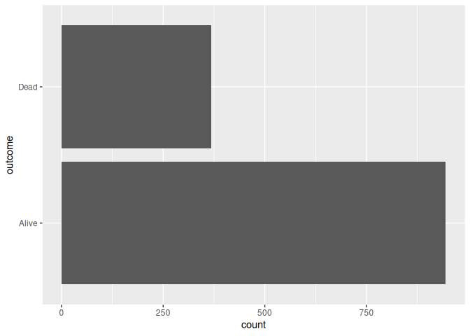
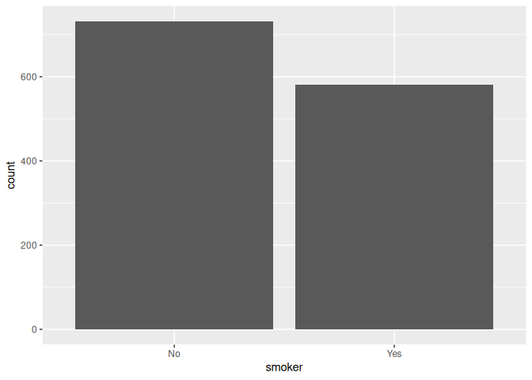
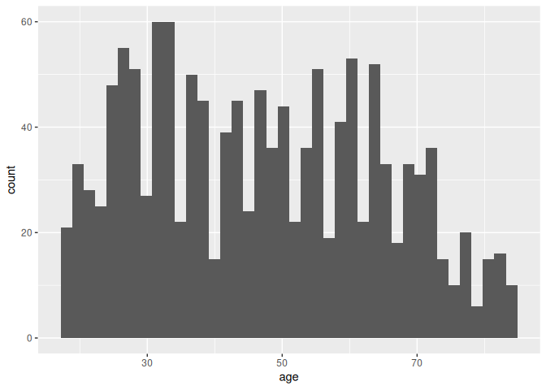
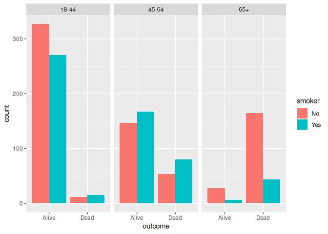

Lab 07 - Simpson’s paradox
================
Kedman
7/12/2025

### Load packages and data

``` r
library(tidyverse) 
library(mosaicData) 
```

### Exercise 1

The study is an observational study and not an experiment. There was no
attempt to control for the outcome which is something that one would
find in an experiment.

### Exercise 2

There are 1314 observations across three variables. Each observation is
a participant in the study.

### Exercise 3

The three variables are the outcome, the age at the time of the first
study and the smoker status of the participant.

The outcome is a factor (character type), age is a number (integer) and
smoker is a factor (char) with two levels yes and no.

``` r
ggplot(Whickham, mapping = aes(y = outcome)) +
  geom_bar() 
```

<!-- -->

``` r
ggplot(Whickham, aes(smoker)) + 
  geom_bar()
```

<!-- -->

``` r
Whickham |> 
  ggplot(aes(age)) +
  geom_histogram(bins = 40)
```

<!-- -->

``` r
ggplot(Whickham, mapping = aes(y = outcome, fill = smoker)) +
  geom_bar(position = "dodge") 
```

<!-- -->

### Exercise 4

For the relationship between smoking status and health outcome, one
would expect the probabilities of being alive to decrease with the
increase in smoking.

### Exercise 5

``` r
Whickham |> 
  count(outcome, smoker)
```

    ##   outcome smoker   n
    ## 1   Alive     No 502
    ## 2   Alive    Yes 443
    ## 3    Dead     No 230
    ## 4    Dead    Yes 139

``` r
Whickham |> 
  count(smoker, outcome)
```

    ##   smoker outcome   n
    ## 1     No   Alive 502
    ## 2     No    Dead 230
    ## 3    Yes   Alive 443
    ## 4    Yes    Dead 139

### Exercise 6

``` r
whickham <- Whickham |> 
  mutate(
    age_cat = case_when(age <= 44 ~ "18-44",
                    age > 44 & age <= 64 ~ "45-64",
                    age > 64 ~ "65+"
                    )
  )
```

``` r
whickham
```

    ##      outcome smoker age age_cat
    ## 1      Alive    Yes  23   18-44
    ## 2      Alive    Yes  18   18-44
    ## 3       Dead    Yes  71     65+
    ## 4      Alive     No  67     65+
    ## 5      Alive     No  64   45-64
    ## 6      Alive    Yes  38   18-44
    ## 7      Alive    Yes  45   45-64
    ## 8       Dead     No  76     65+
    ## 9      Alive     No  28   18-44
    ## 10     Alive     No  27   18-44
    ## 11     Alive     No  28   18-44
    ## 12     Alive    Yes  34   18-44
    ## 13     Alive     No  20   18-44
    ## 14      Dead    Yes  72     65+
    ## 15     Alive    Yes  48   45-64
    ## 16     Alive    Yes  45   45-64
    ## 17      Dead     No  66     65+
    ## 18     Alive    Yes  30   18-44
    ## 19     Alive     No  67     65+
    ## 20     Alive    Yes  33   18-44
    ## 21      Dead     No  68     65+
    ## 22      Dead     No  72     65+
    ## 23     Alive    Yes  34   18-44
    ## 24      Dead     No  61   45-64
    ## 25      Dead     No  66     65+
    ## 26     Alive     No  43   18-44
    ## 27      Dead     No  71     65+
    ## 28     Alive    Yes  47   45-64
    ## 29      Dead     No  67     65+
    ## 30     Alive     No  22   18-44
    ## 31     Alive     No  39   18-44
    ## 32      Dead    Yes  71     65+
    ## 33     Alive    Yes  38   18-44
    ## 34      Dead     No  80     65+
    ## 35      Dead    Yes  59   45-64
    ## 36     Alive    Yes  47   45-64
    ## 37      Dead    Yes  56   45-64
    ## 38      Dead     No  62   45-64
    ## 39     Alive    Yes  30   18-44
    ## 40     Alive    Yes  51   45-64
    ## 41     Alive     No  34   18-44
    ## 42     Alive     No  39   18-44
    ## 43      Dead     No  56   45-64
    ## 44     Alive     No  32   18-44
    ## 45      Dead     No  56   45-64
    ## 46     Alive    Yes  60   45-64
    ## 47      Dead    Yes  60   45-64
    ## 48     Alive     No  30   18-44
    ## 49     Alive    Yes  33   18-44
    ## 50     Alive     No  37   18-44
    ## 51      Dead     No  66     65+
    ## 52      Dead    Yes  71     65+
    ## 53     Alive    Yes  23   18-44
    ## 54     Alive     No  38   18-44
    ## 55     Alive    Yes  36   18-44
    ## 56      Dead    Yes  38   18-44
    ## 57     Alive    Yes  50   45-64
    ## 58     Alive     No  45   45-64
    ## 59     Alive    Yes  36   18-44
    ## 60      Dead     No  55   45-64
    ## 61      Dead    Yes  73     65+
    ## 62      Dead    Yes  52   45-64
    ## 63     Alive     No  52   45-64
    ## 64     Alive    Yes  37   18-44
    ## 65     Alive     No  61   45-64
    ## 66     Alive     No  39   18-44
    ## 67     Alive     No  72     65+
    ## 68     Alive    Yes  25   18-44
    ## 69     Alive    Yes  50   45-64
    ## 70      Dead     No  68     65+
    ## 71     Alive    Yes  53   45-64
    ## 72     Alive     No  31   18-44
    ## 73      Dead     No  73     65+
    ## 74     Alive     No  54   45-64
    ## 75     Alive    Yes  56   45-64
    ## 76     Alive    Yes  51   45-64
    ## 77      Dead     No  76     65+
    ## 78     Alive     No  55   45-64
    ## 79      Dead    Yes  56   45-64
    ## 80     Alive     No  56   45-64
    ## 81      Dead    Yes  69     65+
    ## 82      Dead     No  79     65+
    ## 83      Dead    Yes  75     65+
    ## 84      Dead     No  67     65+
    ## 85     Alive     No  20   18-44
    ## 86     Alive     No  20   18-44
    ## 87      Dead     No  68     65+
    ## 88      Dead    Yes  68     65+
    ## 89     Alive     No  21   18-44
    ## 90     Alive    Yes  29   18-44
    ## 91     Alive    Yes  33   18-44
    ## 92     Alive    Yes  30   18-44
    ## 93     Alive    Yes  24   18-44
    ## 94      Dead    Yes  61   45-64
    ## 95     Alive    Yes  54   45-64
    ## 96     Alive     No  26   18-44
    ## 97      Dead     No  68     65+
    ## 98     Alive    Yes  49   45-64
    ## 99      Dead     No  72     65+
    ## 100    Alive     No  21   18-44
    ## 101    Alive     No  28   18-44
    ## 102    Alive     No  47   45-64
    ## 103     Dead     No  68     65+
    ## 104     Dead     No  71     65+
    ## 105    Alive    Yes  59   45-64
    ## 106    Alive     No  64   45-64
    ## 107    Alive    Yes  47   45-64
    ## 108     Dead     No  84     65+
    ## 109    Alive     No  28   18-44
    ## 110    Alive     No  67     65+
    ## 111    Alive     No  30   18-44
    ## 112     Dead    Yes  33   18-44
    ## 113     Dead     No  68     65+
    ## 114     Dead     No  55   45-64
    ## 115     Dead     No  79     65+
    ## 116    Alive     No  40   18-44
    ## 117    Alive     No  43   18-44
    ## 118    Alive    Yes  37   18-44
    ## 119     Dead     No  73     65+
    ## 120     Dead    Yes  45   45-64
    ## 121    Alive     No  49   45-64
    ## 122    Alive    Yes  44   18-44
    ## 123    Alive    Yes  74     65+
    ## 124    Alive    Yes  20   18-44
    ## 125    Alive    Yes  31   18-44
    ## 126    Alive     No  20   18-44
    ## 127    Alive     No  61   45-64
    ## 128     Dead    Yes  66     65+
    ## 129    Alive     No  53   45-64
    ## 130    Alive    Yes  36   18-44
    ## 131     Dead     No  71     65+
    ## 132     Dead    Yes  64   45-64
    ## 133    Alive     No  52   45-64
    ## 134    Alive     No  37   18-44
    ## 135    Alive    Yes  34   18-44
    ## 136    Alive     No  61   45-64
    ## 137    Alive    Yes  46   45-64
    ## 138    Alive    Yes  26   18-44
    ## 139    Alive     No  33   18-44
    ## 140    Alive     No  32   18-44
    ## 141    Alive    Yes  47   45-64
    ## 142    Alive     No  27   18-44
    ## 143    Alive     No  25   18-44
    ## 144     Dead     No  69     65+
    ## 145     Dead    Yes  43   18-44
    ## 146     Dead    Yes  71     65+
    ## 147    Alive     No  33   18-44
    ## 148     Dead     No  73     65+
    ## 149     Dead     No  68     65+
    ## 150    Alive     No  31   18-44
    ## 151    Alive     No  35   18-44
    ## 152     Dead     No  73     65+
    ## 153     Dead    Yes  59   45-64
    ## 154    Alive     No  31   18-44
    ## 155     Dead     No  77     65+
    ## 156    Alive    Yes  33   18-44
    ## 157    Alive    Yes  48   45-64
    ## 158    Alive    Yes  34   18-44
    ## 159    Alive     No  43   18-44
    ## 160     Dead     No  68     65+
    ## 161    Alive    Yes  29   18-44
    ## 162     Dead     No  71     65+
    ## 163     Dead    Yes  21   18-44
    ## 164    Alive     No  18   18-44
    ## 165    Alive     No  24   18-44
    ## 166    Alive    Yes  30   18-44
    ## 167    Alive     No  24   18-44
    ## 168     Dead     No  74     65+
    ## 169    Alive    Yes  57   45-64
    ## 170    Alive     No  23   18-44
    ## 171    Alive     No  42   18-44
    ## 172    Alive     No  34   18-44
    ## 173    Alive    Yes  46   45-64
    ## 174    Alive     No  40   18-44
    ## 175    Alive    Yes  64   45-64
    ## 176     Dead    Yes  20   18-44
    ## 177    Alive    Yes  30   18-44
    ## 178     Dead    Yes  81     65+
    ## 179     Dead    Yes  45   45-64
    ## 180    Alive     No  26   18-44
    ## 181     Dead     No  77     65+
    ## 182    Alive    Yes  53   45-64
    ## 183    Alive    Yes  46   45-64
    ## 184     Dead     No  69     65+
    ## 185    Alive    Yes  44   18-44
    ## 186     Dead    Yes  50   45-64
    ## 187    Alive    Yes  50   45-64
    ## 188     Dead     No  62   45-64
    ## 189     Dead    Yes  60   45-64
    ## 190    Alive     No  19   18-44
    ## 191    Alive    Yes  21   18-44
    ## 192    Alive    Yes  50   45-64
    ## 193    Alive    Yes  33   18-44
    ## 194     Dead     No  59   45-64
    ## 195     Dead     No  81     65+
    ## 196    Alive    Yes  31   18-44
    ## 197     Dead     No  77     65+
    ## 198    Alive    Yes  23   18-44
    ## 199    Alive     No  55   45-64
    ## 200    Alive     No  51   45-64
    ## 201    Alive     No  26   18-44
    ## 202    Alive     No  20   18-44
    ## 203    Alive     No  57   45-64
    ## 204     Dead     No  67     65+
    ## 205    Alive     No  29   18-44
    ## 206    Alive    Yes  28   18-44
    ## 207    Alive    Yes  26   18-44
    ## 208     Dead     No  76     65+
    ## 209    Alive     No  32   18-44
    ## 210     Dead    Yes  40   18-44
    ## 211    Alive     No  40   18-44
    ## 212    Alive     No  52   45-64
    ## 213     Dead     No  35   18-44
    ## 214    Alive    Yes  27   18-44
    ## 215    Alive    Yes  33   18-44
    ## 216    Alive    Yes  20   18-44
    ## 217    Alive    Yes  31   18-44
    ## 218    Alive     No  28   18-44
    ## 219    Alive     No  22   18-44
    ## 220     Dead    Yes  73     65+
    ## 221    Alive     No  23   18-44
    ## 222    Alive    Yes  24   18-44
    ## 223    Alive     No  48   45-64
    ## 224    Alive     No  60   45-64
    ## 225    Alive    Yes  50   45-64
    ## 226    Alive    Yes  37   18-44
    ## 227    Alive    Yes  29   18-44
    ## 228    Alive     No  35   18-44
    ## 229     Dead     No  67     65+
    ## 230    Alive     No  33   18-44
    ## 231    Alive    Yes  36   18-44
    ## 232     Dead     No  64   45-64
    ## 233    Alive    Yes  59   45-64
    ## 234    Alive     No  23   18-44
    ## 235    Alive    Yes  63   45-64
    ## 236    Alive     No  26   18-44
    ## 237     Dead     No  50   45-64
    ## 238     Dead     No  36   18-44
    ## 239     Dead    Yes  51   45-64
    ## 240    Alive     No  25   18-44
    ## 241    Alive     No  48   45-64
    ## 242    Alive     No  24   18-44
    ## 243     Dead    Yes  42   18-44
    ## 244    Alive     No  64   45-64
    ## 245    Alive     No  36   18-44
    ## 246    Alive    Yes  47   45-64
    ## 247    Alive     No  64   45-64
    ## 248    Alive     No  22   18-44
    ## 249    Alive     No  31   18-44
    ## 250    Alive     No  55   45-64
    ## 251     Dead    Yes  78     65+
    ## 252    Alive     No  27   18-44
    ## 253    Alive     No  63   45-64
    ## 254     Dead    Yes  83     65+
    ## 255    Alive     No  55   45-64
    ## 256    Alive    Yes  57   45-64
    ## 257    Alive    Yes  31   18-44
    ## 258     Dead     No  64   45-64
    ## 259    Alive    Yes  25   18-44
    ## 260    Alive     No  38   18-44
    ## 261     Dead     No  68     65+
    ## 262    Alive     No  59   45-64
    ## 263    Alive    Yes  63   45-64
    ## 264    Alive    Yes  18   18-44
    ## 265    Alive    Yes  44   18-44
    ## 266    Alive     No  38   18-44
    ## 267     Dead    Yes  72     65+
    ## 268    Alive    Yes  28   18-44
    ## 269    Alive    Yes  37   18-44
    ## 270     Dead     No  51   45-64
    ## 271     Dead    Yes  53   45-64
    ## 272    Alive    Yes  31   18-44
    ## 273     Dead     No  69     65+
    ## 274    Alive    Yes  51   45-64
    ## 275    Alive    Yes  36   18-44
    ## 276    Alive     No  27   18-44
    ## 277    Alive    Yes  24   18-44
    ## 278    Alive    Yes  64   45-64
    ## 279    Alive     No  64   45-64
    ## 280    Alive    Yes  64   45-64
    ## 281     Dead     No  64   45-64
    ## 282    Alive    Yes  46   45-64
    ## 283    Alive    Yes  67     65+
    ## 284    Alive    Yes  40   18-44
    ## 285    Alive    Yes  49   45-64
    ## 286    Alive    Yes  25   18-44
    ## 287    Alive    Yes  36   18-44
    ## 288     Dead     No  82     65+
    ## 289    Alive    Yes  56   45-64
    ## 290     Dead    Yes  56   45-64
    ## 291    Alive     No  37   18-44
    ## 292     Dead    Yes  59   45-64
    ## 293    Alive    Yes  42   18-44
    ## 294    Alive     No  44   18-44
    ## 295    Alive    Yes  18   18-44
    ## 296    Alive    Yes  44   18-44
    ## 297    Alive     No  32   18-44
    ## 298    Alive    Yes  38   18-44
    ## 299    Alive    Yes  32   18-44
    ## 300    Alive    Yes  29   18-44
    ## 301    Alive     No  51   45-64
    ## 302    Alive    Yes  34   18-44
    ## 303    Alive    Yes  32   18-44
    ## 304    Alive     No  23   18-44
    ## 305    Alive    Yes  48   45-64
    ## 306    Alive    Yes  24   18-44
    ## 307    Alive    Yes  21   18-44
    ## 308    Alive     No  54   45-64
    ## 309     Dead     No  68     65+
    ## 310    Alive    Yes  26   18-44
    ## 311    Alive     No  51   45-64
    ## 312    Alive    Yes  45   45-64
    ## 313    Alive     No  31   18-44
    ## 314    Alive    Yes  43   18-44
    ## 315    Alive    Yes  30   18-44
    ## 316     Dead     No  72     65+
    ## 317    Alive     No  19   18-44
    ## 318    Alive     No  31   18-44
    ## 319     Dead     No  70     65+
    ## 320    Alive     No  58   45-64
    ## 321    Alive     No  27   18-44
    ## 322    Alive     No  56   45-64
    ## 323     Dead    Yes  46   45-64
    ## 324     Dead     No  75     65+
    ## 325    Alive     No  35   18-44
    ## 326    Alive     No  30   18-44
    ## 327     Dead     No  47   45-64
    ## 328    Alive     No  63   45-64
    ## 329    Alive     No  66     65+
    ## 330    Alive    Yes  41   18-44
    ## 331     Dead    Yes  82     65+
    ## 332    Alive    Yes  39   18-44
    ## 333    Alive    Yes  33   18-44
    ## 334     Dead    Yes  60   45-64
    ## 335     Dead     No  73     65+
    ## 336    Alive    Yes  26   18-44
    ## 337    Alive     No  21   18-44
    ## 338    Alive    Yes  39   18-44
    ## 339     Dead    Yes  51   45-64
    ## 340    Alive     No  28   18-44
    ## 341    Alive    Yes  54   45-64
    ## 342    Alive     No  51   45-64
    ## 343     Dead     No  69     65+
    ## 344    Alive    Yes  63   45-64
    ## 345    Alive    Yes  47   45-64
    ## 346    Alive     No  38   18-44
    ## 347     Dead    Yes  61   45-64
    ## 348    Alive    Yes  31   18-44
    ## 349    Alive    Yes  62   45-64
    ## 350    Alive     No  62   45-64
    ## 351    Alive    Yes  21   18-44
    ## 352    Alive    Yes  32   18-44
    ## 353    Alive     No  38   18-44
    ## 354     Dead     No  67     65+
    ## 355    Alive     No  59   45-64
    ## 356     Dead     No  71     65+
    ## 357    Alive     No  35   18-44
    ## 358    Alive    Yes  28   18-44
    ## 359    Alive    Yes  31   18-44
    ## 360     Dead    Yes  58   45-64
    ## 361    Alive    Yes  53   45-64
    ## 362    Alive     No  48   45-64
    ## 363    Alive     No  27   18-44
    ## 364    Alive     No  30   18-44
    ## 365     Dead    Yes  50   45-64
    ## 366     Dead    Yes  43   18-44
    ## 367    Alive     No  41   18-44
    ## 368    Alive     No  37   18-44
    ## 369    Alive     No  31   18-44
    ## 370    Alive     No  30   18-44
    ## 371    Alive    Yes  52   45-64
    ## 372    Alive    Yes  37   18-44
    ## 373    Alive     No  45   45-64
    ## 374    Alive    Yes  36   18-44
    ## 375    Alive    Yes  34   18-44
    ## 376    Alive    Yes  39   18-44
    ## 377    Alive     No  30   18-44
    ## 378     Dead    Yes  57   45-64
    ## 379    Alive     No  40   18-44
    ## 380     Dead    Yes  62   45-64
    ## 381    Alive    Yes  62   45-64
    ## 382    Alive    Yes  60   45-64
    ## 383    Alive     No  56   45-64
    ## 384    Alive     No  45   45-64
    ## 385    Alive     No  22   18-44
    ## 386    Alive     No  27   18-44
    ## 387    Alive    Yes  18   18-44
    ## 388    Alive    Yes  26   18-44
    ## 389     Dead     No  77     65+
    ## 390    Alive     No  33   18-44
    ## 391    Alive     No  35   18-44
    ## 392    Alive     No  33   18-44
    ## 393     Dead     No  55   45-64
    ## 394    Alive     No  45   45-64
    ## 395    Alive     No  32   18-44
    ## 396    Alive     No  34   18-44
    ## 397    Alive     No  67     65+
    ## 398    Alive     No  35   18-44
    ## 399     Dead    Yes  72     65+
    ## 400     Dead     No  79     65+
    ## 401    Alive    Yes  35   18-44
    ## 402    Alive     No  38   18-44
    ## 403    Alive    Yes  25   18-44
    ## 404    Alive    Yes  37   18-44
    ## 405    Alive     No  56   45-64
    ## 406     Dead     No  66     65+
    ## 407     Dead     No  49   45-64
    ## 408    Alive    Yes  33   18-44
    ## 409     Dead     No  59   45-64
    ## 410    Alive     No  44   18-44
    ## 411    Alive     No  39   18-44
    ## 412     Dead     No  58   45-64
    ## 413    Alive     No  64   45-64
    ## 414    Alive     No  18   18-44
    ## 415    Alive    Yes  45   45-64
    ## 416    Alive     No  33   18-44
    ## 417    Alive     No  32   18-44
    ## 418     Dead     No  80     65+
    ## 419    Alive    Yes  44   18-44
    ## 420    Alive    Yes  25   18-44
    ## 421    Alive     No  68     65+
    ## 422    Alive    Yes  34   18-44
    ## 423    Alive    Yes  29   18-44
    ## 424     Dead    Yes  72     65+
    ## 425    Alive    Yes  32   18-44
    ## 426    Alive    Yes  56   45-64
    ## 427    Alive    Yes  43   18-44
    ## 428     Dead    Yes  60   45-64
    ## 429    Alive    Yes  53   45-64
    ## 430    Alive    Yes  41   18-44
    ## 431    Alive    Yes  63   45-64
    ## 432     Dead    Yes  57   45-64
    ## 433    Alive     No  24   18-44
    ## 434    Alive    Yes  39   18-44
    ## 435    Alive    Yes  39   18-44
    ## 436    Alive     No  31   18-44
    ## 437    Alive    Yes  45   45-64
    ## 438    Alive     No  66     65+
    ## 439    Alive     No  18   18-44
    ## 440     Dead     No  72     65+
    ## 441    Alive     No  49   45-64
    ## 442    Alive     No  37   18-44
    ## 443     Dead     No  68     65+
    ## 444     Dead    Yes  69     65+
    ## 445    Alive     No  27   18-44
    ## 446    Alive    Yes  20   18-44
    ## 447    Alive     No  52   45-64
    ## 448    Alive    Yes  62   45-64
    ## 449    Alive    Yes  64   45-64
    ## 450    Alive    Yes  42   18-44
    ## 451    Alive     No  66     65+
    ## 452     Dead     No  78     65+
    ## 453    Alive     No  33   18-44
    ## 454    Alive     No  31   18-44
    ## 455    Alive    Yes  49   45-64
    ## 456    Alive     No  58   45-64
    ## 457    Alive    Yes  23   18-44
    ## 458    Alive    Yes  41   18-44
    ## 459    Alive    Yes  34   18-44
    ## 460    Alive    Yes  30   18-44
    ## 461    Alive    Yes  24   18-44
    ## 462    Alive    Yes  31   18-44
    ## 463    Alive    Yes  64   45-64
    ## 464     Dead    Yes  81     65+
    ## 465     Dead     No  79     65+
    ## 466    Alive     No  54   45-64
    ## 467    Alive    Yes  47   45-64
    ## 468    Alive    Yes  25   18-44
    ## 469     Dead    Yes  68     65+
    ## 470    Alive    Yes  23   18-44
    ## 471    Alive     No  74     65+
    ## 472    Alive    Yes  25   18-44
    ## 473    Alive    Yes  54   45-64
    ## 474     Dead     No  78     65+
    ## 475     Dead     No  65     65+
    ## 476    Alive    Yes  39   18-44
    ## 477     Dead     No  73     65+
    ## 478    Alive     No  27   18-44
    ## 479    Alive    Yes  62   45-64
    ## 480    Alive    Yes  26   18-44
    ## 481     Dead    Yes  57   45-64
    ## 482    Alive     No  41   18-44
    ## 483    Alive     No  41   18-44
    ## 484     Dead    Yes  66     65+
    ## 485     Dead    Yes  48   45-64
    ## 486     Dead    Yes  68     65+
    ## 487    Alive    Yes  43   18-44
    ## 488    Alive     No  28   18-44
    ## 489    Alive    Yes  58   45-64
    ## 490     Dead    Yes  56   45-64
    ## 491     Dead    Yes  40   18-44
    ## 492     Dead     No  69     65+
    ## 493    Alive    Yes  47   45-64
    ## 494    Alive    Yes  52   45-64
    ## 495    Alive    Yes  52   45-64
    ## 496     Dead     No  80     65+
    ## 497    Alive    Yes  64   45-64
    ## 498    Alive     No  39   18-44
    ## 499    Alive    Yes  54   45-64
    ## 500    Alive     No  55   45-64
    ## 501    Alive     No  51   45-64
    ## 502    Alive    Yes  28   18-44
    ## 503     Dead     No  77     65+
    ## 504    Alive    Yes  27   18-44
    ## 505     Dead     No  82     65+
    ## 506     Dead     No  65     65+
    ## 507     Dead     No  80     65+
    ## 508    Alive     No  46   45-64
    ## 509    Alive    Yes  38   18-44
    ## 510    Alive    Yes  28   18-44
    ## 511     Dead     No  49   45-64
    ## 512    Alive    Yes  44   18-44
    ## 513    Alive     No  30   18-44
    ## 514    Alive     No  63   45-64
    ## 515    Alive     No  63   45-64
    ## 516     Dead    Yes  68     65+
    ## 517    Alive    Yes  46   45-64
    ## 518    Alive     No  52   45-64
    ## 519    Alive     No  52   45-64
    ## 520    Alive     No  55   45-64
    ## 521    Alive     No  74     65+
    ## 522    Alive    Yes  44   18-44
    ## 523    Alive     No  51   45-64
    ## 524    Alive    Yes  35   18-44
    ## 525    Alive    Yes  36   18-44
    ## 526    Alive    Yes  33   18-44
    ## 527    Alive     No  26   18-44
    ## 528    Alive     No  21   18-44
    ## 529    Alive     No  18   18-44
    ## 530    Alive     No  30   18-44
    ## 531     Dead     No  81     65+
    ## 532    Alive    Yes  63   45-64
    ## 533     Dead    Yes  42   18-44
    ## 534    Alive     No  35   18-44
    ## 535    Alive    Yes  38   18-44
    ## 536    Alive     No  28   18-44
    ## 537    Alive    Yes  62   45-64
    ## 538    Alive     No  39   18-44
    ## 539    Alive     No  39   18-44
    ## 540    Alive     No  61   45-64
    ## 541    Alive    Yes  19   18-44
    ## 542    Alive    Yes  46   45-64
    ## 543     Dead    Yes  70     65+
    ## 544    Alive    Yes  38   18-44
    ## 545    Alive     No  33   18-44
    ## 546    Alive    Yes  53   45-64
    ## 547    Alive     No  19   18-44
    ## 548     Dead     No  82     65+
    ## 549    Alive    Yes  49   45-64
    ## 550    Alive    Yes  47   45-64
    ## 551     Dead     No  78     65+
    ## 552    Alive    Yes  22   18-44
    ## 553    Alive    Yes  31   18-44
    ## 554    Alive     No  31   18-44
    ## 555    Alive     No  57   45-64
    ## 556    Alive     No  65     65+
    ## 557     Dead     No  68     65+
    ## 558    Alive    Yes  22   18-44
    ## 559    Alive    Yes  27   18-44
    ## 560    Alive    Yes  50   45-64
    ## 561     Dead    Yes  53   45-64
    ## 562    Alive     No  34   18-44
    ## 563    Alive    Yes  37   18-44
    ## 564    Alive     No  35   18-44
    ## 565    Alive     No  38   18-44
    ## 566     Dead     No  43   18-44
    ## 567    Alive    Yes  34   18-44
    ## 568    Alive     No  64   45-64
    ## 569    Alive     No  43   18-44
    ## 570     Dead    Yes  57   45-64
    ## 571    Alive    Yes  55   45-64
    ## 572    Alive    Yes  34   18-44
    ## 573    Alive     No  29   18-44
    ## 574    Alive     No  18   18-44
    ## 575     Dead     No  38   18-44
    ## 576    Alive    Yes  40   18-44
    ## 577    Alive     No  44   18-44
    ## 578     Dead     No  71     65+
    ## 579     Dead    Yes  61   45-64
    ## 580    Alive    Yes  26   18-44
    ## 581     Dead     No  35   18-44
    ## 582    Alive     No  26   18-44
    ## 583    Alive     No  39   18-44
    ## 584    Alive    Yes  43   18-44
    ## 585    Alive    Yes  44   18-44
    ## 586    Alive     No  38   18-44
    ## 587    Alive     No  37   18-44
    ## 588     Dead    Yes  52   45-64
    ## 589    Alive     No  56   45-64
    ## 590     Dead     No  70     65+
    ## 591    Alive    Yes  39   18-44
    ## 592     Dead    Yes  57   45-64
    ## 593    Alive    Yes  46   45-64
    ## 594    Alive    Yes  28   18-44
    ## 595    Alive     No  21   18-44
    ## 596     Dead    Yes  66     65+
    ## 597    Alive    Yes  38   18-44
    ## 598    Alive    Yes  32   18-44
    ## 599    Alive    Yes  23   18-44
    ## 600    Alive     No  61   45-64
    ## 601    Alive    Yes  32   18-44
    ## 602    Alive     No  27   18-44
    ## 603     Dead    Yes  73     65+
    ## 604    Alive    Yes  36   18-44
    ## 605    Alive     No  33   18-44
    ## 606    Alive     No  28   18-44
    ## 607    Alive     No  43   18-44
    ## 608    Alive    Yes  56   45-64
    ## 609    Alive     No  27   18-44
    ## 610    Alive     No  36   18-44
    ## 611    Alive     No  20   18-44
    ## 612     Dead     No  69     65+
    ## 613    Alive     No  44   18-44
    ## 614    Alive    Yes  26   18-44
    ## 615     Dead    Yes  31   18-44
    ## 616     Dead     No  72     65+
    ## 617     Dead     No  84     65+
    ## 618    Alive    Yes  48   45-64
    ## 619    Alive     No  18   18-44
    ## 620     Dead    Yes  82     65+
    ## 621    Alive    Yes  51   45-64
    ## 622    Alive    Yes  33   18-44
    ## 623    Alive     No  56   45-64
    ## 624    Alive     No  74     65+
    ## 625    Alive     No  24   18-44
    ## 626     Dead     No  74     65+
    ## 627    Alive     No  28   18-44
    ## 628    Alive    Yes  58   45-64
    ## 629    Alive    Yes  49   45-64
    ## 630     Dead    Yes  64   45-64
    ## 631    Alive     No  34   18-44
    ## 632     Dead     No  84     65+
    ## 633     Dead    Yes  47   45-64
    ## 634    Alive    Yes  58   45-64
    ## 635     Dead    Yes  63   45-64
    ## 636     Dead     No  57   45-64
    ## 637    Alive    Yes  18   18-44
    ## 638    Alive     No  23   18-44
    ## 639    Alive     No  51   45-64
    ## 640    Alive     No  55   45-64
    ## 641    Alive     No  49   45-64
    ## 642     Dead     No  60   45-64
    ## 643    Alive     No  39   18-44
    ## 644    Alive     No  48   45-64
    ## 645    Alive     No  28   18-44
    ## 646     Dead     No  74     65+
    ## 647    Alive    Yes  61   45-64
    ## 648    Alive    Yes  33   18-44
    ## 649     Dead     No  64   45-64
    ## 650     Dead     No  77     65+
    ## 651    Alive    Yes  51   45-64
    ## 652    Alive    Yes  23   18-44
    ## 653     Dead     No  43   18-44
    ## 654    Alive     No  47   45-64
    ## 655    Alive     No  27   18-44
    ## 656    Alive     No  48   45-64
    ## 657    Alive    Yes  29   18-44
    ## 658    Alive     No  45   45-64
    ## 659    Alive    Yes  31   18-44
    ## 660     Dead    Yes  60   45-64
    ## 661    Alive     No  53   45-64
    ## 662    Alive     No  26   18-44
    ## 663     Dead    Yes  61   45-64
    ## 664    Alive     No  38   18-44
    ## 665    Alive     No  22   18-44
    ## 666    Alive    Yes  41   18-44
    ## 667    Alive    Yes  27   18-44
    ## 668    Alive     No  63   45-64
    ## 669     Dead    Yes  60   45-64
    ## 670     Dead     No  64   45-64
    ## 671    Alive     No  58   45-64
    ## 672    Alive     No  42   18-44
    ## 673     Dead     No  82     65+
    ## 674     Dead     No  62   45-64
    ## 675    Alive     No  64   45-64
    ## 676    Alive     No  34   18-44
    ## 677    Alive     No  58   45-64
    ## 678    Alive    Yes  63   45-64
    ## 679     Dead     No  63   45-64
    ## 680     Dead     No  79     65+
    ## 681    Alive     No  44   18-44
    ## 682    Alive     No  41   18-44
    ## 683    Alive     No  34   18-44
    ## 684    Alive    Yes  38   18-44
    ## 685    Alive    Yes  54   45-64
    ## 686    Alive     No  53   45-64
    ## 687     Dead     No  80     65+
    ## 688     Dead    Yes  46   45-64
    ## 689    Alive    Yes  61   45-64
    ## 690     Dead     No  72     65+
    ## 691    Alive    Yes  61   45-64
    ## 692    Alive    Yes  28   18-44
    ## 693    Alive    Yes  20   18-44
    ## 694     Dead    Yes  46   45-64
    ## 695     Dead     No  56   45-64
    ## 696     Dead     No  84     65+
    ## 697     Dead    Yes  64   45-64
    ## 698     Dead     No  42   18-44
    ## 699    Alive     No  30   18-44
    ## 700    Alive     No  48   45-64
    ## 701    Alive    Yes  25   18-44
    ## 702     Dead     No  76     65+
    ## 703     Dead    Yes  61   45-64
    ## 704    Alive     No  41   18-44
    ## 705    Alive     No  29   18-44
    ## 706     Dead     No  80     65+
    ## 707    Alive    Yes  56   45-64
    ## 708    Alive    Yes  58   45-64
    ## 709     Dead     No  73     65+
    ## 710    Alive     No  18   18-44
    ## 711    Alive     No  42   18-44
    ## 712     Dead     No  67     65+
    ## 713    Alive     No  30   18-44
    ## 714     Dead     No  78     65+
    ## 715     Dead    Yes  36   18-44
    ## 716     Dead     No  78     65+
    ## 717    Alive     No  44   18-44
    ## 718    Alive     No  35   18-44
    ## 719    Alive    Yes  53   45-64
    ## 720     Dead     No  52   45-64
    ## 721    Alive    Yes  63   45-64
    ## 722     Dead     No  79     65+
    ## 723    Alive     No  51   45-64
    ## 724    Alive     No  59   45-64
    ## 725    Alive     No  62   45-64
    ## 726    Alive     No  35   18-44
    ## 727    Alive     No  32   18-44
    ## 728    Alive    Yes  48   45-64
    ## 729     Dead    Yes  53   45-64
    ## 730     Dead    Yes  49   45-64
    ## 731    Alive    Yes  23   18-44
    ## 732    Alive    Yes  50   45-64
    ## 733    Alive     No  26   18-44
    ## 734     Dead    Yes  44   18-44
    ## 735     Dead    Yes  71     65+
    ## 736     Dead     No  78     65+
    ## 737    Alive     No  40   18-44
    ## 738    Alive     No  71     65+
    ## 739    Alive    Yes  62   45-64
    ## 740    Alive     No  30   18-44
    ## 741    Alive     No  32   18-44
    ## 742     Dead     No  71     65+
    ## 743    Alive     No  70     65+
    ## 744    Alive     No  27   18-44
    ## 745     Dead    Yes  60   45-64
    ## 746     Dead     No  65     65+
    ## 747     Dead     No  72     65+
    ## 748    Alive     No  22   18-44
    ## 749    Alive    Yes  26   18-44
    ## 750    Alive     No  26   18-44
    ## 751    Alive    Yes  30   18-44
    ## 752    Alive    Yes  21   18-44
    ## 753    Alive    Yes  28   18-44
    ## 754    Alive     No  60   45-64
    ## 755    Alive     No  53   45-64
    ## 756    Alive    Yes  59   45-64
    ## 757     Dead    Yes  63   45-64
    ## 758    Alive    Yes  36   18-44
    ## 759    Alive     No  34   18-44
    ## 760    Alive    Yes  61   45-64
    ## 761     Dead     No  65     65+
    ## 762     Dead    Yes  59   45-64
    ## 763     Dead     No  70     65+
    ## 764     Dead    Yes  48   45-64
    ## 765    Alive    Yes  50   45-64
    ## 766     Dead     No  83     65+
    ## 767    Alive     No  51   45-64
    ## 768    Alive    Yes  24   18-44
    ## 769    Alive     No  46   45-64
    ## 770    Alive     No  19   18-44
    ## 771    Alive    Yes  36   18-44
    ## 772    Alive     No  33   18-44
    ## 773     Dead     No  56   45-64
    ## 774    Alive     No  57   45-64
    ## 775    Alive     No  44   18-44
    ## 776    Alive     No  53   45-64
    ## 777    Alive    Yes  30   18-44
    ## 778    Alive     No  42   18-44
    ## 779    Alive    Yes  42   18-44
    ## 780    Alive    Yes  58   45-64
    ## 781    Alive     No  32   18-44
    ## 782    Alive     No  30   18-44
    ## 783     Dead     No  73     65+
    ## 784    Alive     No  34   18-44
    ## 785     Dead    Yes  76     65+
    ## 786    Alive    Yes  51   45-64
    ## 787     Dead     No  71     65+
    ## 788     Dead     No  60   45-64
    ## 789    Alive     No  36   18-44
    ## 790    Alive    Yes  18   18-44
    ## 791    Alive     No  34   18-44
    ## 792     Dead     No  70     65+
    ## 793    Alive    Yes  50   45-64
    ## 794    Alive    Yes  41   18-44
    ## 795    Alive     No  55   45-64
    ## 796    Alive     No  36   18-44
    ## 797     Dead    Yes  66     65+
    ## 798    Alive     No  58   45-64
    ## 799    Alive    Yes  31   18-44
    ## 800    Alive     No  36   18-44
    ## 801     Dead     No  68     65+
    ## 802    Alive     No  24   18-44
    ## 803    Alive     No  25   18-44
    ## 804    Alive    Yes  42   18-44
    ## 805    Alive     No  31   18-44
    ## 806    Alive    Yes  18   18-44
    ## 807    Alive    Yes  27   18-44
    ## 808    Alive     No  20   18-44
    ## 809    Alive     No  40   18-44
    ## 810    Alive    Yes  57   45-64
    ## 811    Alive     No  73     65+
    ## 812    Alive     No  44   18-44
    ## 813    Alive     No  63   45-64
    ## 814    Alive     No  19   18-44
    ## 815     Dead    Yes  49   45-64
    ## 816    Alive     No  59   45-64
    ## 817    Alive    Yes  23   18-44
    ## 818    Alive    Yes  53   45-64
    ## 819    Alive    Yes  51   45-64
    ## 820    Alive    Yes  22   18-44
    ## 821    Alive     No  24   18-44
    ## 822    Alive    Yes  51   45-64
    ## 823    Alive    Yes  26   18-44
    ## 824     Dead     No  68     65+
    ## 825     Dead     No  56   45-64
    ## 826    Alive     No  47   45-64
    ## 827    Alive    Yes  36   18-44
    ## 828    Alive    Yes  46   45-64
    ## 829    Alive     No  26   18-44
    ## 830    Alive    Yes  74     65+
    ## 831    Alive     No  26   18-44
    ## 832    Alive    Yes  52   45-64
    ## 833    Alive     No  57   45-64
    ## 834    Alive    Yes  34   18-44
    ## 835    Alive     No  60   45-64
    ## 836    Alive    Yes  32   18-44
    ## 837    Alive    Yes  41   18-44
    ## 838     Dead     No  82     65+
    ## 839    Alive    Yes  31   18-44
    ## 840    Alive     No  68     65+
    ## 841    Alive     No  25   18-44
    ## 842     Dead     No  84     65+
    ## 843    Alive     No  37   18-44
    ## 844    Alive     No  37   18-44
    ## 845     Dead     No  83     65+
    ## 846    Alive     No  62   45-64
    ## 847    Alive     No  25   18-44
    ## 848    Alive    Yes  55   45-64
    ## 849    Alive     No  23   18-44
    ## 850    Alive    Yes  52   45-64
    ## 851    Alive    Yes  33   18-44
    ## 852    Alive    Yes  53   45-64
    ## 853    Alive     No  55   45-64
    ## 854    Alive    Yes  45   45-64
    ## 855    Alive    Yes  19   18-44
    ## 856    Alive    Yes  53   45-64
    ## 857    Alive     No  18   18-44
    ## 858    Alive    Yes  32   18-44
    ## 859    Alive     No  32   18-44
    ## 860     Dead     No  67     65+
    ## 861     Dead    Yes  60   45-64
    ## 862    Alive    Yes  35   18-44
    ## 863    Alive    Yes  60   45-64
    ## 864    Alive    Yes  56   45-64
    ## 865    Alive     No  28   18-44
    ## 866     Dead     No  61   45-64
    ## 867    Alive    Yes  46   45-64
    ## 868    Alive     No  22   18-44
    ## 869     Dead     No  55   45-64
    ## 870     Dead     No  66     65+
    ## 871     Dead    Yes  71     65+
    ## 872     Dead     No  68     65+
    ## 873    Alive     No  50   45-64
    ## 874    Alive    Yes  32   18-44
    ## 875    Alive     No  24   18-44
    ## 876    Alive     No  38   18-44
    ## 877    Alive     No  64   45-64
    ## 878     Dead    Yes  51   45-64
    ## 879    Alive    Yes  29   18-44
    ## 880     Dead     No  77     65+
    ## 881    Alive     No  25   18-44
    ## 882    Alive     No  50   45-64
    ## 883    Alive     No  61   45-64
    ## 884    Alive    Yes  23   18-44
    ## 885     Dead     No  67     65+
    ## 886     Dead     No  73     65+
    ## 887    Alive     No  23   18-44
    ## 888    Alive    Yes  59   45-64
    ## 889     Dead     No  61   45-64
    ## 890    Alive    Yes  43   18-44
    ## 891    Alive     No  25   18-44
    ## 892    Alive     No  39   18-44
    ## 893    Alive     No  45   45-64
    ## 894    Alive     No  25   18-44
    ## 895    Alive    Yes  52   45-64
    ## 896     Dead     No  46   45-64
    ## 897    Alive     No  25   18-44
    ## 898    Alive     No  30   18-44
    ## 899    Alive    Yes  62   45-64
    ## 900    Alive     No  58   45-64
    ## 901    Alive    Yes  25   18-44
    ## 902    Alive     No  31   18-44
    ## 903     Dead     No  46   45-64
    ## 904     Dead    Yes  27   18-44
    ## 905     Dead     No  68     65+
    ## 906    Alive    Yes  35   18-44
    ## 907    Alive     No  25   18-44
    ## 908    Alive    Yes  42   18-44
    ## 909     Dead     No  72     65+
    ## 910    Alive    Yes  55   45-64
    ## 911    Alive     No  29   18-44
    ## 912    Alive    Yes  29   18-44
    ## 913    Alive    Yes  36   18-44
    ## 914     Dead     No  51   45-64
    ## 915     Dead     No  80     65+
    ## 916     Dead     No  74     65+
    ## 917    Alive     No  20   18-44
    ## 918     Dead     No  45   45-64
    ## 919    Alive     No  46   45-64
    ## 920    Alive    Yes  43   18-44
    ## 921    Alive     No  66     65+
    ## 922     Dead    Yes  45   45-64
    ## 923    Alive    Yes  71     65+
    ## 924    Alive     No  43   18-44
    ## 925    Alive    Yes  27   18-44
    ## 926    Alive     No  22   18-44
    ## 927    Alive    Yes  41   18-44
    ## 928    Alive     No  60   45-64
    ## 929    Alive    Yes  46   45-64
    ## 930    Alive     No  29   18-44
    ## 931     Dead    Yes  55   45-64
    ## 932    Alive    Yes  36   18-44
    ## 933     Dead     No  84     65+
    ## 934    Alive     No  67     65+
    ## 935     Dead     No  45   45-64
    ## 936    Alive     No  34   18-44
    ## 937     Dead     No  65     65+
    ## 938    Alive    Yes  32   18-44
    ## 939     Dead     No  71     65+
    ## 940    Alive     No  26   18-44
    ## 941    Alive    Yes  26   18-44
    ## 942     Dead     No  72     65+
    ## 943    Alive     No  45   45-64
    ## 944    Alive     No  27   18-44
    ## 945    Alive    Yes  36   18-44
    ## 946    Alive     No  34   18-44
    ## 947     Dead     No  78     65+
    ## 948    Alive    Yes  20   18-44
    ## 949    Alive    Yes  46   45-64
    ## 950    Alive     No  27   18-44
    ## 951    Alive     No  74     65+
    ## 952    Alive    Yes  46   45-64
    ## 953    Alive    Yes  31   18-44
    ## 954    Alive    Yes  46   45-64
    ## 955    Alive     No  58   45-64
    ## 956     Dead     No  72     65+
    ## 957     Dead    Yes  56   45-64
    ## 958    Alive     No  45   45-64
    ## 959    Alive     No  60   45-64
    ## 960     Dead     No  65     65+
    ## 961     Dead     No  71     65+
    ## 962     Dead     No  76     65+
    ## 963    Alive     No  55   45-64
    ## 964    Alive     No  35   18-44
    ## 965    Alive    Yes  44   18-44
    ## 966     Dead    Yes  47   45-64
    ## 967     Dead    Yes  63   45-64
    ## 968    Alive    Yes  32   18-44
    ## 969    Alive     No  43   18-44
    ## 970    Alive    Yes  35   18-44
    ## 971     Dead    Yes  63   45-64
    ## 972    Alive     No  29   18-44
    ## 973    Alive     No  51   45-64
    ## 974    Alive    Yes  42   18-44
    ## 975     Dead    Yes  45   45-64
    ## 976    Alive    Yes  19   18-44
    ## 977     Dead     No  69     65+
    ## 978    Alive    Yes  39   18-44
    ## 979     Dead    Yes  61   45-64
    ## 980    Alive    Yes  19   18-44
    ## 981    Alive     No  53   45-64
    ## 982    Alive    Yes  61   45-64
    ## 983    Alive     No  40   18-44
    ## 984    Alive     No  37   18-44
    ## 985    Alive     No  37   18-44
    ## 986     Dead     No  65     65+
    ## 987    Alive     No  74     65+
    ## 988    Alive    Yes  50   45-64
    ## 989    Alive    Yes  25   18-44
    ## 990    Alive     No  32   18-44
    ## 991    Alive     No  28   18-44
    ## 992    Alive     No  71     65+
    ## 993     Dead     No  27   18-44
    ## 994    Alive     No  23   18-44
    ## 995    Alive    Yes  64   45-64
    ## 996    Alive     No  28   18-44
    ## 997     Dead     No  56   45-64
    ## 998    Alive     No  25   18-44
    ## 999     Dead    Yes  61   45-64
    ## 1000   Alive     No  63   45-64
    ## 1001   Alive     No  24   18-44
    ## 1002   Alive     No  64   45-64
    ## 1003    Dead     No  58   45-64
    ## 1004   Alive     No  34   18-44
    ## 1005   Alive     No  31   18-44
    ## 1006   Alive    Yes  33   18-44
    ## 1007   Alive    Yes  48   45-64
    ## 1008   Alive    Yes  55   45-64
    ## 1009   Alive     No  72     65+
    ## 1010   Alive     No  43   18-44
    ## 1011   Alive    Yes  20   18-44
    ## 1012   Alive    Yes  62   45-64
    ## 1013   Alive     No  18   18-44
    ## 1014   Alive    Yes  21   18-44
    ## 1015   Alive     No  38   18-44
    ## 1016   Alive    Yes  45   45-64
    ## 1017    Dead    Yes  81     65+
    ## 1018   Alive    Yes  66     65+
    ## 1019   Alive     No  33   18-44
    ## 1020   Alive    Yes  32   18-44
    ## 1021   Alive     No  29   18-44
    ## 1022   Alive    Yes  53   45-64
    ## 1023   Alive     No  21   18-44
    ## 1024   Alive     No  61   45-64
    ## 1025   Alive     No  24   18-44
    ## 1026    Dead     No  54   45-64
    ## 1027   Alive    Yes  46   45-64
    ## 1028   Alive     No  58   45-64
    ## 1029    Dead     No  65     65+
    ## 1030    Dead     No  82     65+
    ## 1031   Alive     No  53   45-64
    ## 1032    Dead     No  33   18-44
    ## 1033   Alive    Yes  49   45-64
    ## 1034   Alive     No  42   18-44
    ## 1035   Alive    Yes  43   18-44
    ## 1036   Alive    Yes  20   18-44
    ## 1037    Dead     No  56   45-64
    ## 1038    Dead     No  82     65+
    ## 1039    Dead     No  72     65+
    ## 1040   Alive     No  20   18-44
    ## 1041    Dead     No  82     65+
    ## 1042   Alive     No  62   45-64
    ## 1043   Alive    Yes  54   45-64
    ## 1044   Alive     No  54   45-64
    ## 1045    Dead    Yes  82     65+
    ## 1046   Alive    Yes  47   45-64
    ## 1047   Alive    Yes  18   18-44
    ## 1048    Dead     No  72     65+
    ## 1049   Alive    Yes  35   18-44
    ## 1050    Dead     No  69     65+
    ## 1051   Alive     No  52   45-64
    ## 1052    Dead     No  59   45-64
    ## 1053    Dead    Yes  52   45-64
    ## 1054   Alive    Yes  29   18-44
    ## 1055   Alive     No  21   18-44
    ## 1056   Alive     No  28   18-44
    ## 1057   Alive    Yes  25   18-44
    ## 1058   Alive    Yes  25   18-44
    ## 1059   Alive    Yes  58   45-64
    ## 1060   Alive    Yes  43   18-44
    ## 1061   Alive     No  62   45-64
    ## 1062    Dead     No  67     65+
    ## 1063   Alive    Yes  48   45-64
    ## 1064   Alive    Yes  54   45-64
    ## 1065   Alive    Yes  42   18-44
    ## 1066   Alive     No  66     65+
    ## 1067   Alive    Yes  23   18-44
    ## 1068   Alive    Yes  67     65+
    ## 1069   Alive     No  47   45-64
    ## 1070   Alive     No  28   18-44
    ## 1071   Alive     No  38   18-44
    ## 1072   Alive     No  64   45-64
    ## 1073    Dead     No  57   45-64
    ## 1074   Alive     No  56   45-64
    ## 1075   Alive     No  34   18-44
    ## 1076   Alive    Yes  50   45-64
    ## 1077   Alive     No  58   45-64
    ## 1078   Alive     No  32   18-44
    ## 1079    Dead     No  77     65+
    ## 1080   Alive    Yes  23   18-44
    ## 1081   Alive    Yes  36   18-44
    ## 1082    Dead     No  18   18-44
    ## 1083   Alive     No  47   45-64
    ## 1084    Dead     No  70     65+
    ## 1085    Dead    Yes  60   45-64
    ## 1086    Dead     No  71     65+
    ## 1087    Dead    Yes  56   45-64
    ## 1088   Alive    Yes  32   18-44
    ## 1089   Alive     No  28   18-44
    ## 1090   Alive     No  51   45-64
    ## 1091   Alive     No  37   18-44
    ## 1092   Alive     No  30   18-44
    ## 1093    Dead     No  77     65+
    ## 1094    Dead     No  70     65+
    ## 1095   Alive     No  41   18-44
    ## 1096   Alive     No  32   18-44
    ## 1097   Alive    Yes  48   45-64
    ## 1098   Alive     No  53   45-64
    ## 1099    Dead    Yes  65     65+
    ## 1100    Dead     No  66     65+
    ## 1101    Dead    Yes  59   45-64
    ## 1102    Dead     No  60   45-64
    ## 1103    Dead    Yes  58   45-64
    ## 1104   Alive     No  64   45-64
    ## 1105   Alive    Yes  61   45-64
    ## 1106    Dead     No  62   45-64
    ## 1107   Alive     No  58   45-64
    ## 1108   Alive     No  37   18-44
    ## 1109    Dead    Yes  53   45-64
    ## 1110   Alive     No  65     65+
    ## 1111   Alive     No  27   18-44
    ## 1112    Dead     No  72     65+
    ## 1113    Dead    Yes  60   45-64
    ## 1114   Alive    Yes  45   45-64
    ## 1115   Alive    Yes  63   45-64
    ## 1116   Alive     No  32   18-44
    ## 1117   Alive     No  18   18-44
    ## 1118   Alive    Yes  49   45-64
    ## 1119   Alive     No  34   18-44
    ## 1120   Alive     No  23   18-44
    ## 1121   Alive     No  61   45-64
    ## 1122   Alive     No  44   18-44
    ## 1123   Alive     No  66     65+
    ## 1124   Alive     No  28   18-44
    ## 1125   Alive    Yes  44   18-44
    ## 1126   Alive    Yes  29   18-44
    ## 1127   Alive    Yes  38   18-44
    ## 1128   Alive    Yes  52   45-64
    ## 1129   Alive    Yes  54   45-64
    ## 1130   Alive    Yes  63   45-64
    ## 1131    Dead    Yes  45   45-64
    ## 1132    Dead     No  74     65+
    ## 1133   Alive     No  24   18-44
    ## 1134   Alive     No  40   18-44
    ## 1135   Alive     No  28   18-44
    ## 1136   Alive    Yes  30   18-44
    ## 1137   Alive    Yes  43   18-44
    ## 1138    Dead    Yes  63   45-64
    ## 1139   Alive    Yes  33   18-44
    ## 1140   Alive    Yes  41   18-44
    ## 1141   Alive     No  60   45-64
    ## 1142   Alive    Yes  31   18-44
    ## 1143   Alive    Yes  47   45-64
    ## 1144    Dead     No  81     65+
    ## 1145    Dead     No  78     65+
    ## 1146   Alive     No  56   45-64
    ## 1147    Dead     No  73     65+
    ## 1148   Alive     No  56   45-64
    ## 1149   Alive    Yes  28   18-44
    ## 1150   Alive    Yes  22   18-44
    ## 1151   Alive     No  34   18-44
    ## 1152   Alive     No  48   45-64
    ## 1153   Alive     No  27   18-44
    ## 1154   Alive    Yes  47   45-64
    ## 1155   Alive     No  31   18-44
    ## 1156   Alive     No  47   45-64
    ## 1157    Dead     No  60   45-64
    ## 1158    Dead     No  59   45-64
    ## 1159    Dead     No  80     65+
    ## 1160   Alive    Yes  41   18-44
    ## 1161    Dead    Yes  46   45-64
    ## 1162   Alive    Yes  50   45-64
    ## 1163   Alive     No  48   45-64
    ## 1164   Alive     No  37   18-44
    ## 1165   Alive    Yes  50   45-64
    ## 1166   Alive    Yes  25   18-44
    ## 1167   Alive     No  25   18-44
    ## 1168   Alive     No  41   18-44
    ## 1169   Alive     No  24   18-44
    ## 1170   Alive    Yes  57   45-64
    ## 1171    Dead     No  71     65+
    ## 1172   Alive    Yes  26   18-44
    ## 1173    Dead     No  32   18-44
    ## 1174   Alive     No  25   18-44
    ## 1175    Dead     No  84     65+
    ## 1176   Alive    Yes  19   18-44
    ## 1177   Alive     No  26   18-44
    ## 1178   Alive    Yes  58   45-64
    ## 1179    Dead    Yes  67     65+
    ## 1180   Alive     No  24   18-44
    ## 1181    Dead    Yes  74     65+
    ## 1182   Alive    Yes  58   45-64
    ## 1183   Alive     No  57   45-64
    ## 1184   Alive    Yes  52   45-64
    ## 1185   Alive    Yes  42   18-44
    ## 1186   Alive     No  42   18-44
    ## 1187    Dead     No  69     65+
    ## 1188    Dead    Yes  39   18-44
    ## 1189    Dead    Yes  84     65+
    ## 1190   Alive    Yes  57   45-64
    ## 1191   Alive     No  42   18-44
    ## 1192   Alive     No  35   18-44
    ## 1193   Alive     No  23   18-44
    ## 1194   Alive     No  65     65+
    ## 1195   Alive    Yes  28   18-44
    ## 1196   Alive     No  39   18-44
    ## 1197   Alive    Yes  36   18-44
    ## 1198   Alive     No  40   18-44
    ## 1199   Alive     No  39   18-44
    ## 1200   Alive     No  19   18-44
    ## 1201   Alive     No  61   45-64
    ## 1202   Alive    Yes  37   18-44
    ## 1203   Alive    Yes  52   45-64
    ## 1204   Alive    Yes  62   45-64
    ## 1205   Alive     No  30   18-44
    ## 1206   Alive    Yes  23   18-44
    ## 1207    Dead    Yes  72     65+
    ## 1208   Alive    Yes  46   45-64
    ## 1209   Alive     No  33   18-44
    ## 1210   Alive     No  32   18-44
    ## 1211   Alive     No  27   18-44
    ## 1212    Dead    Yes  72     65+
    ## 1213    Dead    Yes  53   45-64
    ## 1214    Dead    Yes  58   45-64
    ## 1215   Alive    Yes  32   18-44
    ## 1216   Alive     No  25   18-44
    ## 1217    Dead     No  71     65+
    ## 1218   Alive    Yes  37   18-44
    ## 1219   Alive    Yes  41   18-44
    ## 1220    Dead     No  75     65+
    ## 1221   Alive     No  29   18-44
    ## 1222    Dead    Yes  62   45-64
    ## 1223   Alive    Yes  30   18-44
    ## 1224   Alive     No  20   18-44
    ## 1225   Alive    Yes  26   18-44
    ## 1226    Dead     No  60   45-64
    ## 1227    Dead     No  65     65+
    ## 1228    Dead    Yes  63   45-64
    ## 1229   Alive     No  19   18-44
    ## 1230    Dead    Yes  55   45-64
    ## 1231   Alive    Yes  45   45-64
    ## 1232   Alive     No  28   18-44
    ## 1233   Alive    Yes  21   18-44
    ## 1234   Alive     No  35   18-44
    ## 1235   Alive     No  24   18-44
    ## 1236    Dead     No  74     65+
    ## 1237    Dead     No  63   45-64
    ## 1238   Alive     No  44   18-44
    ## 1239   Alive    Yes  26   18-44
    ## 1240    Dead     No  84     65+
    ## 1241   Alive    Yes  27   18-44
    ## 1242   Alive     No  28   18-44
    ## 1243    Dead    Yes  60   45-64
    ## 1244   Alive     No  44   18-44
    ## 1245    Dead     No  82     65+
    ## 1246    Dead     No  29   18-44
    ## 1247   Alive    Yes  52   45-64
    ## 1248   Alive    Yes  42   18-44
    ## 1249   Alive    Yes  18   18-44
    ## 1250    Dead     No  61   45-64
    ## 1251    Dead     No  60   45-64
    ## 1252   Alive    Yes  19   18-44
    ## 1253    Dead     No  84     65+
    ## 1254    Dead     No  72     65+
    ## 1255   Alive     No  59   45-64
    ## 1256    Dead     No  78     65+
    ## 1257   Alive     No  41   18-44
    ## 1258   Alive     No  21   18-44
    ## 1259   Alive     No  31   18-44
    ## 1260    Dead     No  83     65+
    ## 1261   Alive     No  62   45-64
    ## 1262    Dead     No  76     65+
    ## 1263    Dead    Yes  63   45-64
    ## 1264   Alive     No  44   18-44
    ## 1265    Dead     No  65     65+
    ## 1266   Alive     No  33   18-44
    ## 1267   Alive    Yes  40   18-44
    ## 1268   Alive     No  50   45-64
    ## 1269    Dead     No  74     65+
    ## 1270   Alive     No  19   18-44
    ## 1271   Alive     No  50   45-64
    ## 1272    Dead    Yes  62   45-64
    ## 1273   Alive    Yes  25   18-44
    ## 1274    Dead    Yes  66     65+
    ## 1275   Alive     No  67     65+
    ## 1276   Alive    Yes  18   18-44
    ## 1277   Alive    Yes  28   18-44
    ## 1278   Alive    Yes  49   45-64
    ## 1279   Alive    Yes  39   18-44
    ## 1280   Alive    Yes  33   18-44
    ## 1281   Alive     No  44   18-44
    ## 1282   Alive     No  48   45-64
    ## 1283   Alive    Yes  37   18-44
    ## 1284    Dead    Yes  71     65+
    ## 1285    Dead     No  66     65+
    ## 1286   Alive    Yes  34   18-44
    ## 1287    Dead    Yes  77     65+
    ## 1288   Alive     No  48   45-64
    ## 1289   Alive    Yes  60   45-64
    ## 1290   Alive     No  41   18-44
    ## 1291   Alive     No  55   45-64
    ## 1292   Alive    Yes  46   45-64
    ## 1293   Alive     No  55   45-64
    ## 1294   Alive     No  20   18-44
    ## 1295    Dead    Yes  80     65+
    ## 1296   Alive    Yes  57   45-64
    ## 1297   Alive     No  52   45-64
    ## 1298   Alive    Yes  48   45-64
    ## 1299   Alive     No  30   18-44
    ## 1300   Alive    Yes  57   45-64
    ## 1301   Alive    Yes  37   18-44
    ## 1302   Alive     No  27   18-44
    ## 1303   Alive     No  37   18-44
    ## 1304   Alive     No  36   18-44
    ## 1305   Alive     No  23   18-44
    ## 1306    Dead     No  55   45-64
    ## 1307   Alive     No  40   18-44
    ## 1308   Alive     No  33   18-44
    ## 1309   Alive     No  23   18-44
    ## 1310   Alive    Yes  35   18-44
    ## 1311   Alive     No  33   18-44
    ## 1312   Alive    Yes  21   18-44
    ## 1313   Alive     No  46   45-64
    ## 1314   Alive    Yes  41   18-44

### Exercise 7

``` r
whickham |> 
  count(smoker, age_cat, outcome)
```

    ##    smoker age_cat outcome   n
    ## 1      No   18-44   Alive 327
    ## 2      No   18-44    Dead  12
    ## 3      No   45-64   Alive 147
    ## 4      No   45-64    Dead  53
    ## 5      No     65+   Alive  28
    ## 6      No     65+    Dead 165
    ## 7     Yes   18-44   Alive 270
    ## 8     Yes   18-44    Dead  15
    ## 9     Yes   45-64   Alive 167
    ## 10    Yes   45-64    Dead  80
    ## 11    Yes     65+   Alive   6
    ## 12    Yes     65+    Dead  44

``` r
whickham |> 
  ggplot(aes(outcome, fill = smoker)) +
  geom_bar(position = "dodge") +
  facet_grid(cols = vars(age_cat)) # facet_grid(~ age_cat)
```

<!-- -->
